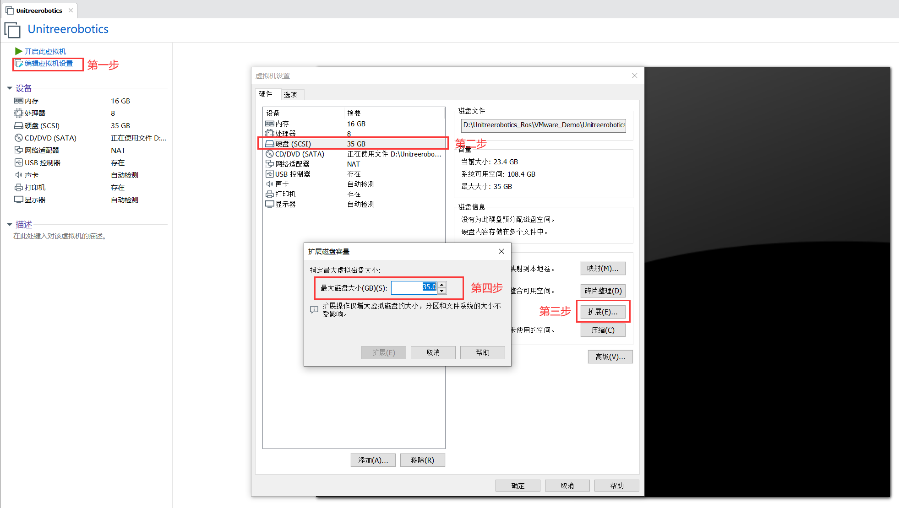
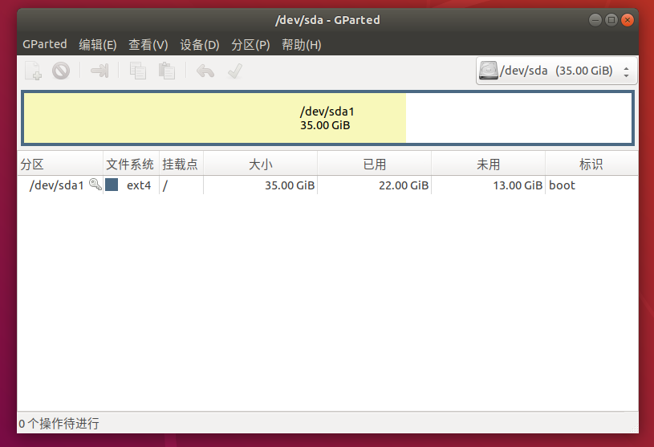
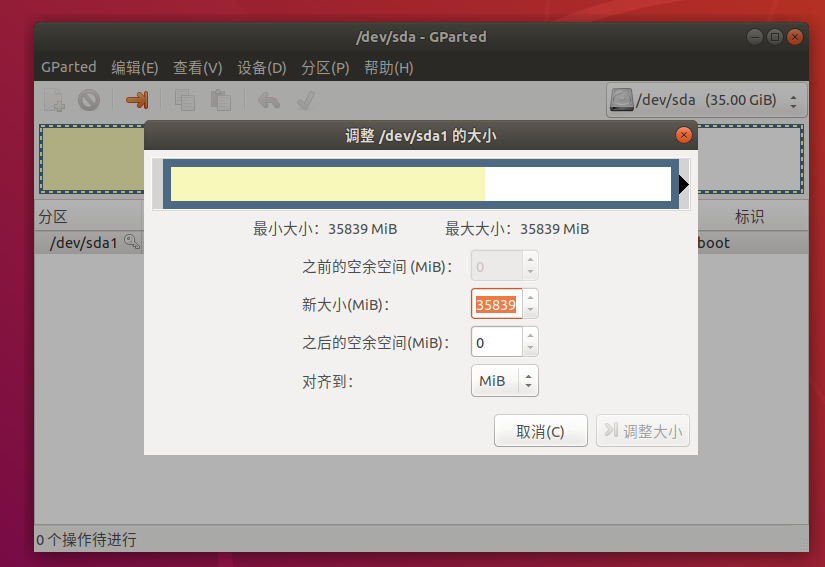

## 一、问题引入

> 使用VMware虚拟机时，通常用着用着当初分配的内存空间不够了，这时候就需要对虚拟机内存空间进行拓展。

## 二、详细步骤

1. 配置VMware虚拟机设置



2. 查看硬盘大小及使用情况

```c
df -h
```

3. 安装gparted软件

```c
sudo apt-get install gparted
```



4. 扩容并保存



## 三、参考链接

1. [VMware虚拟机扩容磁盘，有很详细图文](https://blog.csdn.net/hktkfly6/article/details/123302335)
2. [VMware虚拟机扩展磁盘容量](https://blog.csdn.net/Chen_qi_hai/article/details/108814596)


联系笔者：[ehangmaker@163.com](mailto:ehangmaker@163.com)

