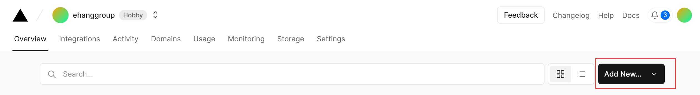
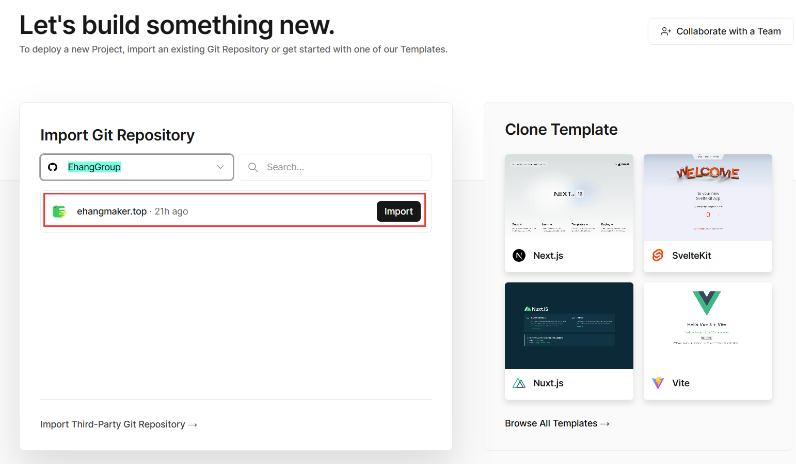
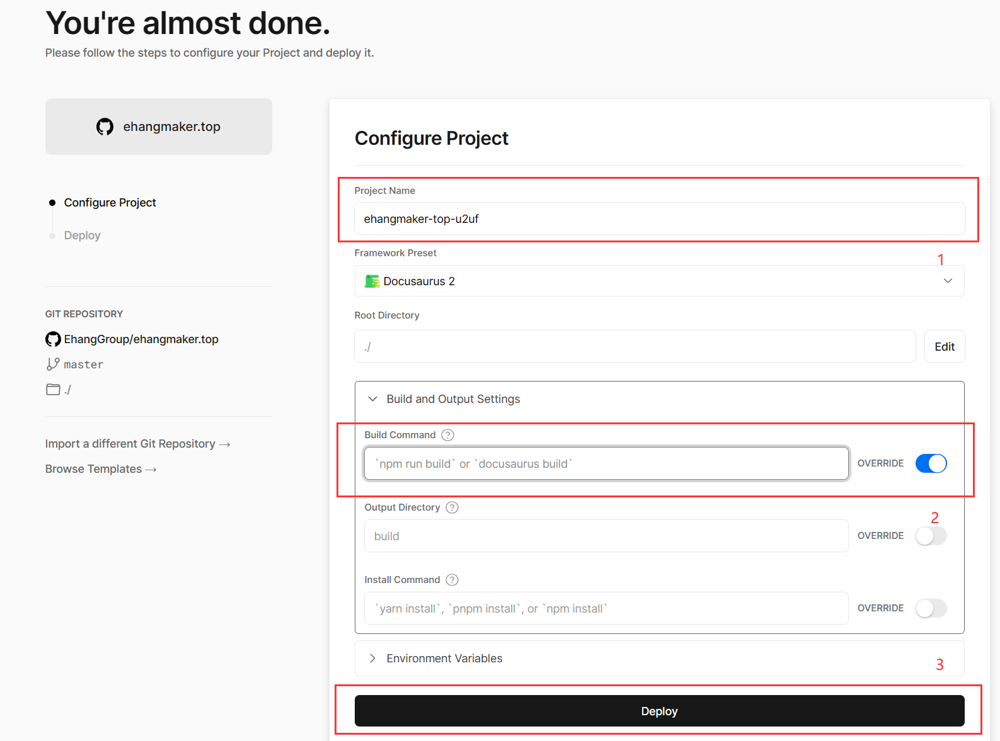
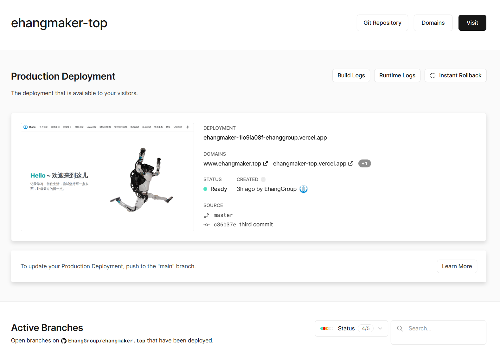
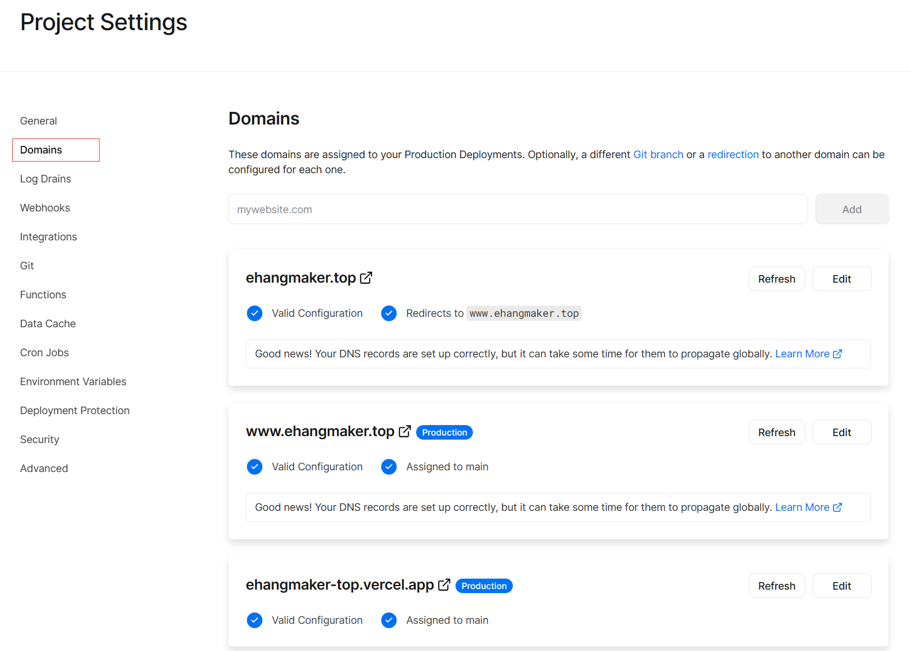

## 一、问题引入

> 使用开源框架Docusaurus搭建属于自己的个人博客方法

## 二、环境配置

- 详情可根据[Docusaurus官方](https://www.docusaurus.cn/docs/installation)的步骤进行配置。

### 2.1  安装 Node.js

- 访问 [Node.js 官网](https://nodejs.org/zh-cn/)，下载并安装 Node.js，Node.js 版本 >= 14 或者更高。

### 2.2 博客模板

- 可前往[Docusaurus 站点展示](https://www.docusaurus.cn/showcase)找到自己心怡的模板，并在此基础上进行构建。

### 2.3 相关命令

- 安装

```
npm install
```

- 编译

```
npm run build
```

- 预览

```
npm install
```


## 三、将网站部署到云端

- 完成上述步骤后，你只能在本地看到自己的网页，此时需要将网页部署在云端。

### 3.1 新建[Github仓库](https://github.com/)，使用Git进行管理

### 3.2 使用Vercel云端部署网站











## 四、网站的自动更新

- 在本地编辑完文章之后，使用Git推送到仓库后，Vercel会自动识别更新，并重新部署。

## 五、域名解析配置

在域名控制台中，增加 / 修改域名解析为：

| **主机记录** | **记录类型** | **记录值**           | **TTL**              |
| ------------ | ------------ | -------------------- | -------------------- |
| @            | CNAME        | cname.vercel-dns.com | cname.vercel-dns.com |

**没提到的项视为默认。**

## **六、参考链接**

1. **[Docusaurus文档中心](https://docusaurus.io/zh-CN/)**
2. **[Vercel官网](https://vercel.com/)**


**联系笔者：[ehangmaker@163.com](mailto:ehangmaker@163.com)**

