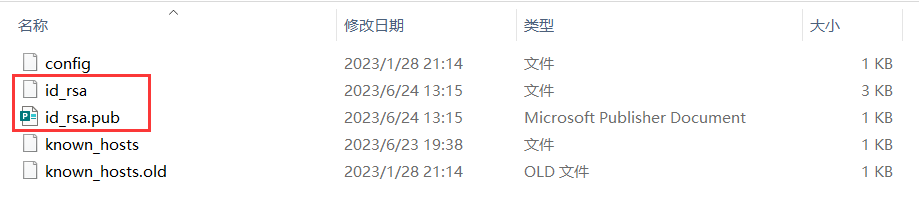
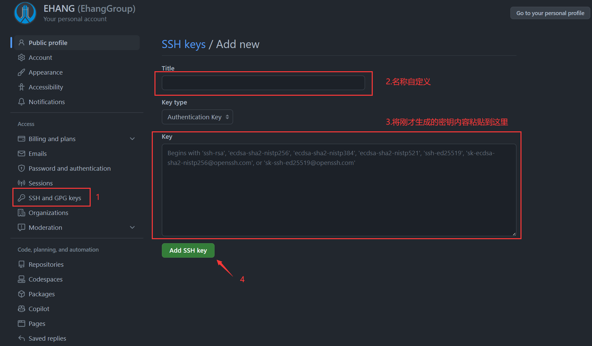
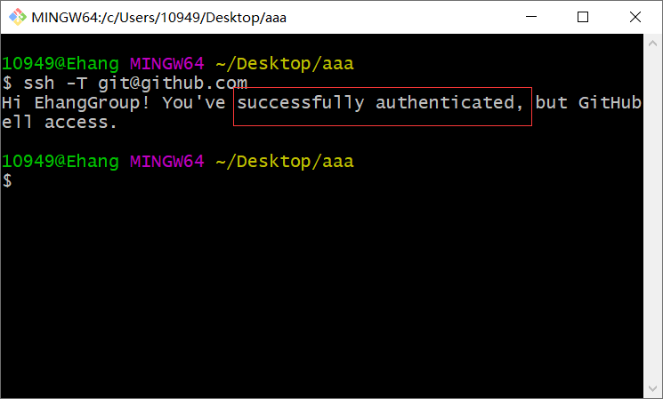
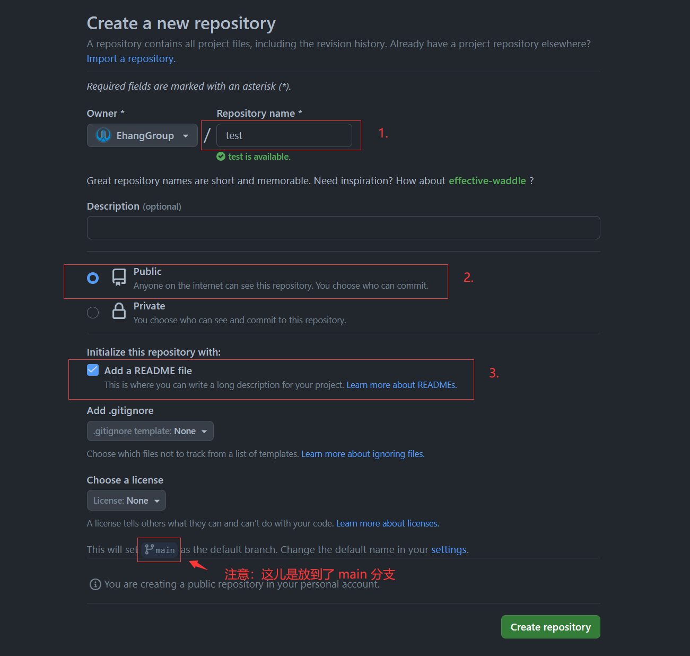
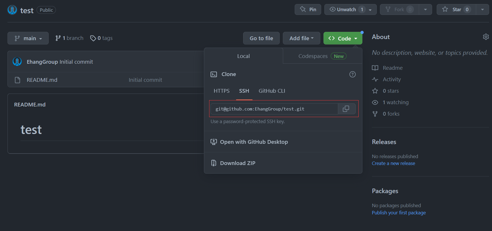
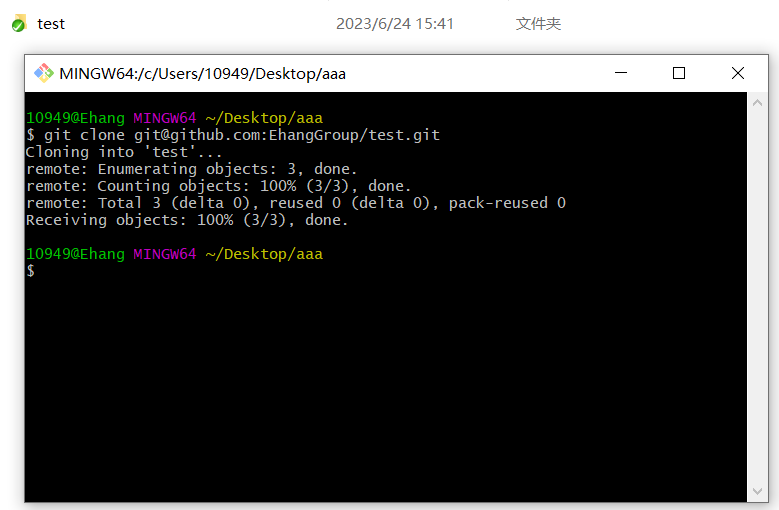
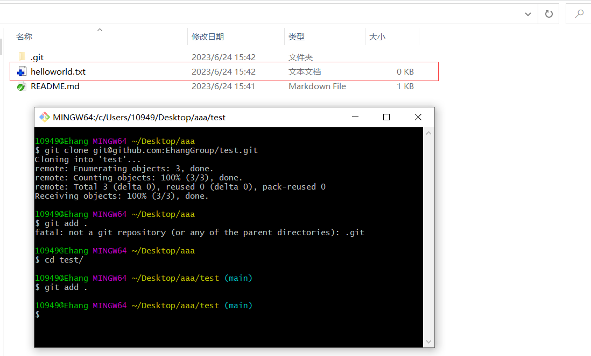
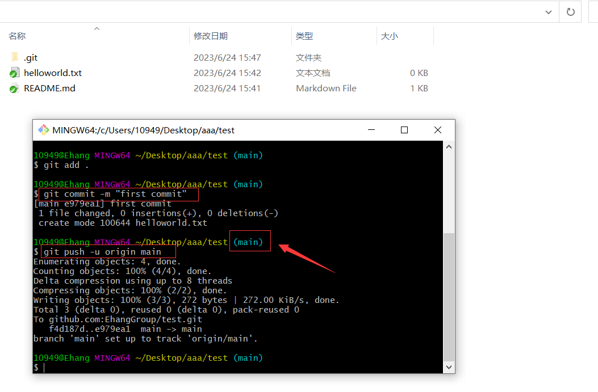

## 一、问题引入

> 创建Github仓库并使用Git工具进行管理，配置密钥

## 二、Git配置

### 2.1 配置用户名以及邮箱

- 配置的用户名以及邮箱便是以后你提交代码时的身份（" "中的内容请自行更换）

```
git config --globa user.name "yourname"
```

```
git config --globa user.email "youremail@xxxxx.com"
```

- 查看上述配置信息

```
git config --get user.name
```

```
git config --get user.email
```

- 查看Git全部配置信息

```
git config --list
```

### 2.2 生成密钥文件

```
ssh-keygen -t rsa -b 4096 -C "youremail@xxxxx.com"
```

- **注：命令点击以后需要点三次确认：**

1. 首先要你确认文件要放到的文件夹，一般是~/.ssh
2. 随后让你输入密码，如果每次提交不想输入密码的话，可以为空，直接点确定
3. 随后再输入一遍密码

**密钥文件存储截图：**



### 2.3 复制密钥内容

- 打开【id_rsa.pub】这个文件，将内容复制，稍后将内容粘贴到Github上。

## 三、Github密钥配置

### 3.1 配置如下



### 3.2 验证

```
ssh -T git@github.com
```



## 四、Github仓库构建

### 4.1 设置仓库名



### 4.2 复制Git链接



### 4.3 拉取仓库内容

```
git clone git@github.com:EhangGroup/test.git
```



### 4.4 将新添加的内容add到仓库

```
git add .
```



### 4.5 增加提交信息并推送

```
git commit -m "first commit"
```

```
git push -u origin main
```



## 五、常用Git命令

- 推送一个新的仓库

```c
git init
git add README.md
git commit -m "first commit"
git branch -M main
git remote add origin git@github.com:EhangGroup/test.git
git push -u origin main
```

- 推送一个已有仓库

```c
git remote add origin git@github.com:EhangGroup/test.git
git branch -M main
git push -u origin main
```

- 切换分支

```
git branch -M main
```

```
git branch -M master
```


联系笔者：[ehangmaker@163.com](mailto:ehangmaker@163.com)

