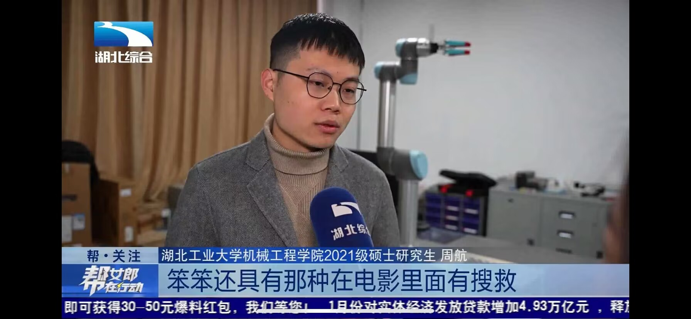
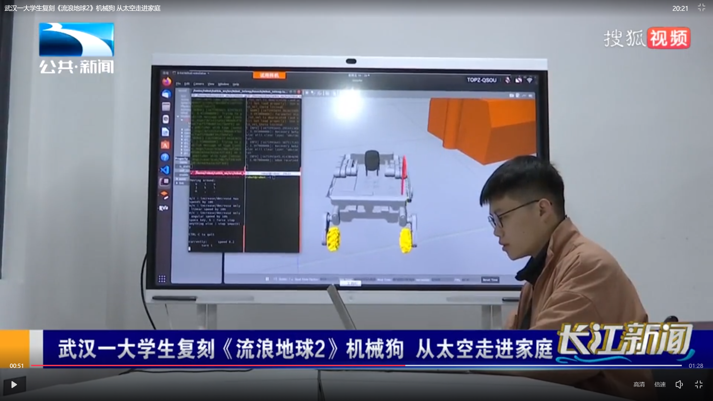
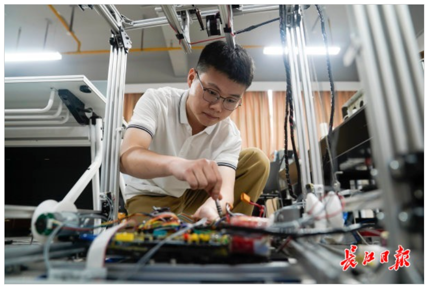
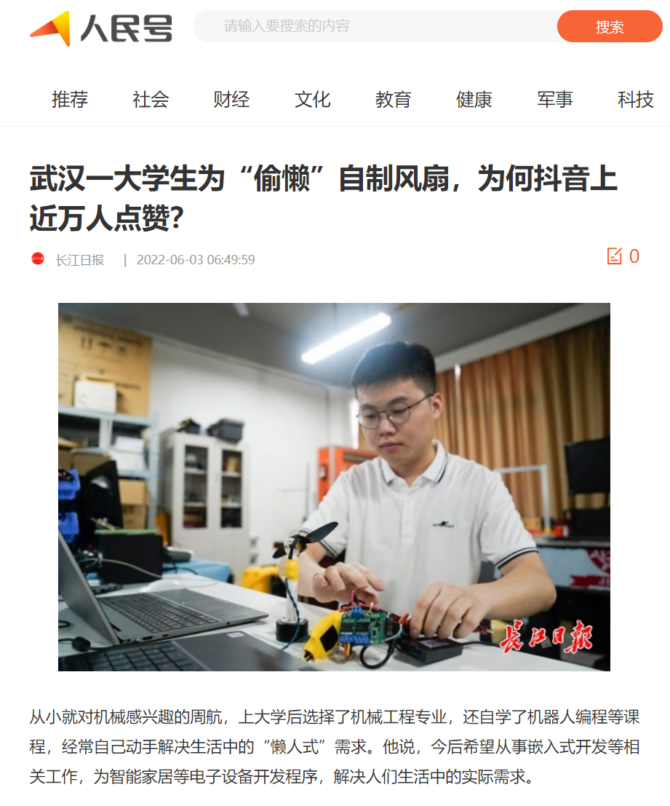
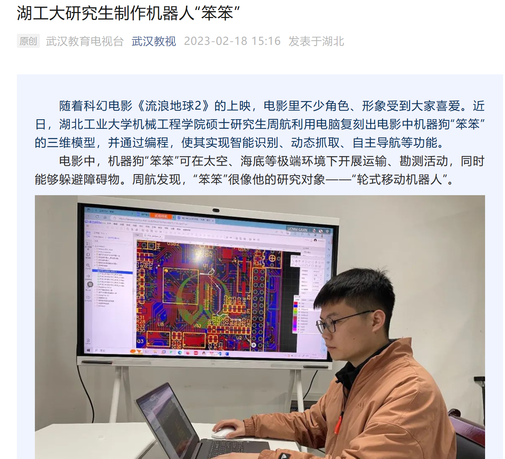

## 一、概述

- **关于我：**

1. 我的名字：Ehang , 注定就与科技分不开了。小时候的梦想就是当一名宇航员👨‍🚀，会守在电视机前关注每一次神州飞船🚀的发射~
2. 研究方向：攻读硕士期间致力于移动机器人“精确定位”、“路径规划”、“轨迹跟踪”方面的研究，对移动机器人、各种软硬件系统有丰富的经验
3. 个人定位：机器人狂热爱好者，痴迷各种功能的机器人；软硬件兼施攻城狮，致力于机器人全栈研发
4. 科研成果：申请国家发明专利11项，目前已授权5项；发表论文3篇；申请软件著作权2项；个人创新事迹被《人民日报》等权威媒体综合报道30余次

- **关于我的工作室：**

1. 创办时间：EhangMaker工作室在2019年6月27日正式创办，并入驻学校创新创业孵化器。
2. Logo：其Logo由本人在2018年使用CAD设计，其外形由不规则圆环组成，寓意着产品多元一体，内形呈蓄势待发的火箭形状，并被包裹在蓝色的圆环内。“火箭”体现着亿航创客工作室未来的发展方向将以研发尖端制造业产品为目标，“火箭“架设在“蓝色星球”内是对亿航未来的核心技术将引领全球的美好寄托。

- **关于我的爱好：**

🤖【机器人】小时候家里的电器好像都被我拆解过，买过最多的书就是《科幻书》~ 所以对机器人一直是痴迷的态度（：

🏃 【长跑】从本科开始，KEEP已经累计奔跑了1500KM+；跑过两次半程马拉松，最好成绩为1：45'：23"

📖【阅读】书中自有黄金屋，书中自有颜如玉

- **重要比赛经历**

1. Robocon老参赛队员，先后担任过副队长、控制组组长、机械组组长，三届带领团队拿到三二一等奖各一枚
2. 2022年第八届中国国际“互联网+”大学生创新创业大赛中获湖北省金奖、国家铜奖（担任队长）
3. 2023年第十三届“挑战杯”中国大学生创业计划竞赛中获湖北省金奖、国家银奖（担任队长）

- **联系方式**

📥【邮箱】ehangmaker@163.com

## 二、专业技能

1. 熟悉嵌入式MCU开发，多种MCU开发经历（STM32、GD32、ESP32、CC2530）；掌握嵌入式MCU应用开发，有（IMX6U、JETSON NANO、树莓派）等平台的应用开发经验；熟悉外围端口以及驱动的编写（ADC、EEPROM、Timer、PWM、GPIO、CAN、UART、IIC、SPI等）；熟悉FreeRTOS、Rt-Thread、Linux等嵌入式操作系统，有操作系统下开发BSP的经验，熟悉多线程编程；了解与掌握多种通信协议（CAN、TCP/IP、USB）;了解跨平台GUI库QT的开发，具有Linux下QT应用开发经验。
2. 熟悉ROS下机器人应用开发，熟悉相关关键理论和技术（定位、路径规划、轨迹跟踪、卡尔曼滤波、PID控制等）；熟悉机器人的运动学和动力学建模及仿真分析；掌握多种ROS开发工具（RViz、Gazebo、Moveit、rqt等）；能够完成ROS下多种传感器、执行器的驱动编写、数据采集和处理；熟悉Linux程序架构设计，熟悉C、C++、Python开发语言；有ROS功能包（Navigation、SLAM、AMCL等）调试经验，有ROS、AGV开发经验。
3. 熟悉常用机器人传感器和执行器的开发调试，熟悉有刷/无刷电机的控制。
4. 熟悉基本硬件原理，能看懂芯片手册，掌握多种电路设计软件（AD、立创EDA），能够自主设计MCU外围电路，传感器电路，DC电路，能绘制四层普通电路板，熟练使用示波器、逻辑分析仪等仪器，具备软硬调试能力。
5. 掌握多种建模工具，能够使用建模软件（SW、CAD）对机器人结构进行自主设计及改进。

## 三、媒体关注

> 对这些报道材料的看法：当初本人只是通过短视频分享一些自己的创客作品，能受到广大观众的喜欢并受到媒体的关注，很感谢他们，也给了我持续创新的动力。在这里仅仅是记录一下，我也会继续保持初心，埋头苦干！

个人科研成果被《人民日报》、《中国青年报》、《湖北日报》、《长江日报》、《湖北经视》、《湖工大新闻网》等权威媒体50余次报道，阅读量超100000余次。

| 序号 | 媒体名称         | 稿件名称                                                     | 稿件截图                                                     |
| ---- | ---------------- | ------------------------------------------------------------ | ------------------------------------------------------------ |
| 1    | 湖北经视         | [武汉一大学生复刻《流浪地球2》机械狗 从太空走进家庭](https://news.hbtv.com.cn/p/2363827.html) |  |
| 2    | 湖北综合         | [学以致用！大学生复刻《流浪地球2》机械狗“笨笨”](https://m.hbtv.com.cn/p/2363539.html) |  |
| 3    | 湖北公共         | [湖工大研究生制作机器人“笨笨”](https://news.hbut.edu.cn/info/1005/28216.htm) |  |
| 4    | 极目新闻         | [发明人脸追踪电风扇，做出《流浪地球》同款机械狗，武汉大学生发明多个“宝藏”小玩意](http://jms.ctdsb.net/jmythshare/#/news_detail?contentType=5&contentId=1677775&cId=0) |  |
| 5    | 长江日报         | [【大武汉客户端】武汉一大学生为“偷懒”自制风扇，为何抖音上近万人点赞？](https://news.hbut.edu.cn/info/1005/27100.htm) |  |
| 6    | 长江日报         | [学以致用！武汉大学生复刻《流浪地球2》机械狗“笨笨”](https://baijiahao.baidu.com/s?id=1757174620501006938&wfr=spider&for=pc) |  |
| 7    | 武汉晚报         | [武汉大学生复刻《流浪地球2》里的机械狗“笨笨”](http://whwb.cjn.cn/html/202304/18/node_73.htm) |  |
| 8    | 武汉晚报         | [武汉一大学生为“偷懒”自制风扇，为何抖音上近万人点赞？](http://whwb.cjn.cn/html/202304/18/node_73.htm) |  |
| 9    | 中国青年报       | [【中国青年报】00后大学生动手复刻《流浪地球2》机器狗“笨笨”](https://www.hbut.edu.cn/info/1046/29377.htm) |  |
| 10   | 人民日报  人民号 | [武汉一大学生为“偷懒”自制风扇，为何抖音上近万人点赞？](https://rmh.pdnews.cn/Pc/ArticleApi/lists) |  |
| 11   | 腾讯网           | [武汉大学生复刻《流浪地球2》里的机械狗“笨笨”](https://new.qq.com/rain/a/20230208A039MF00) |  |
| 12   | 武汉教育电视台   | [湖工大研究生制作机器人"笨笨"](http://app.whjyapp.com/)      |  |

