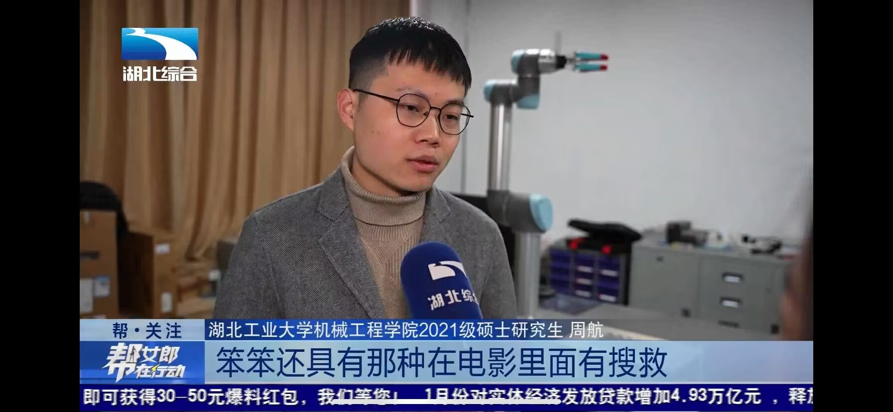
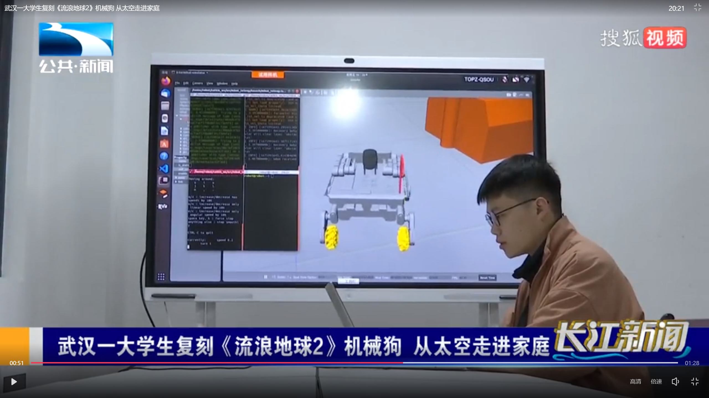
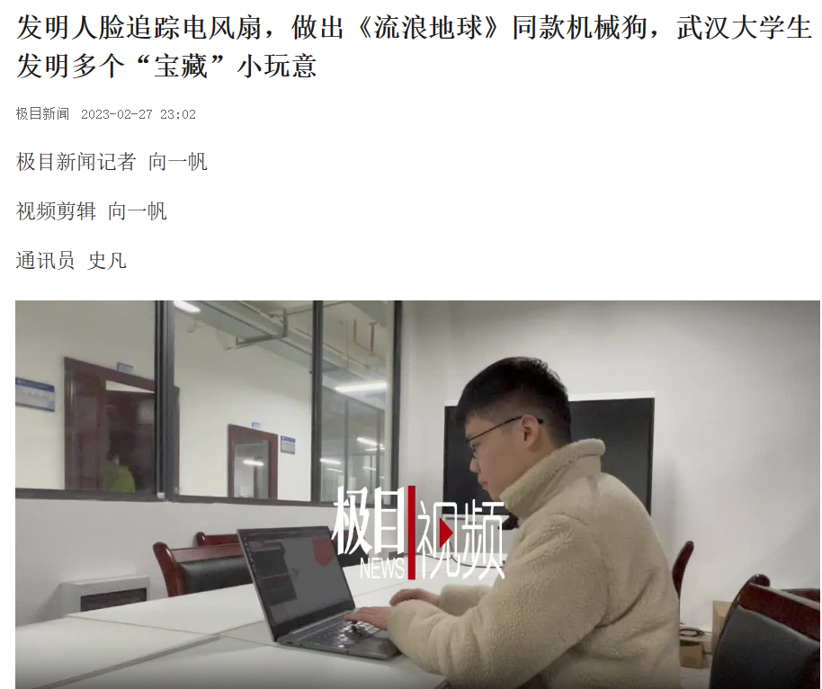
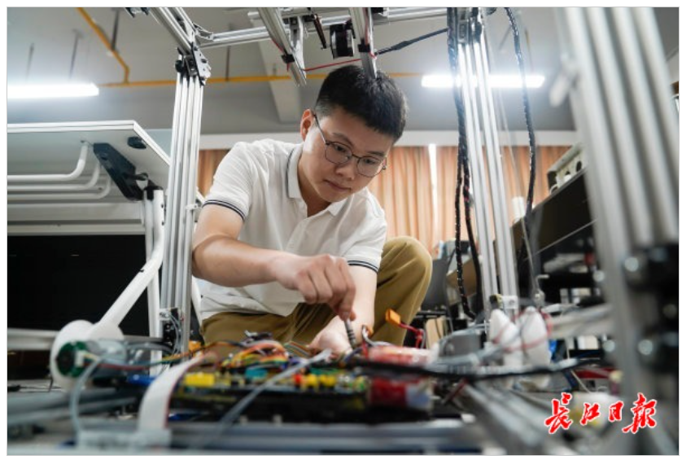
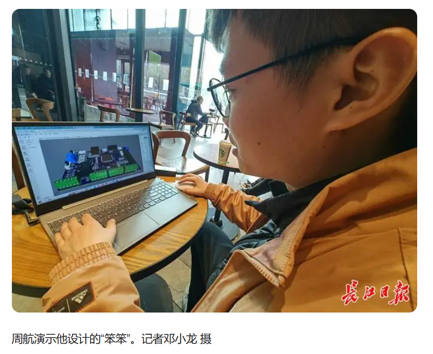
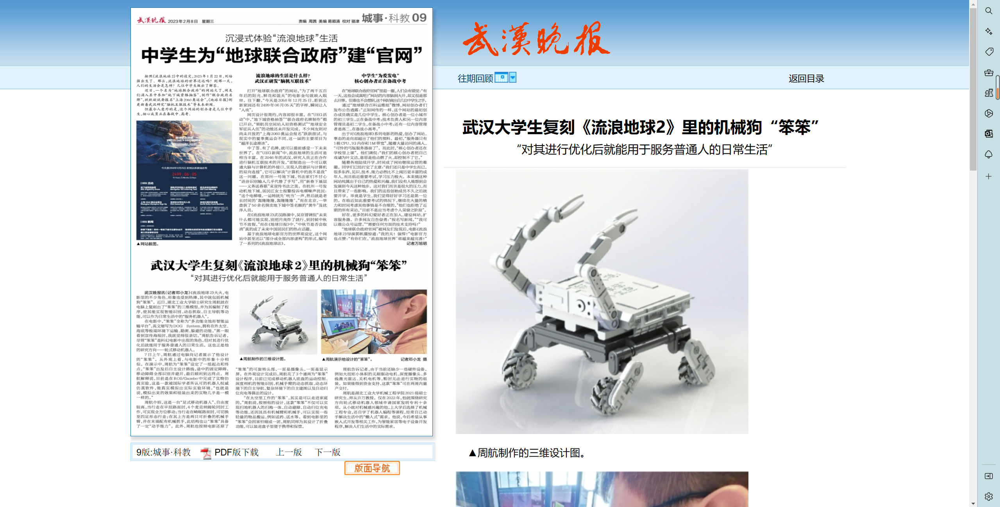
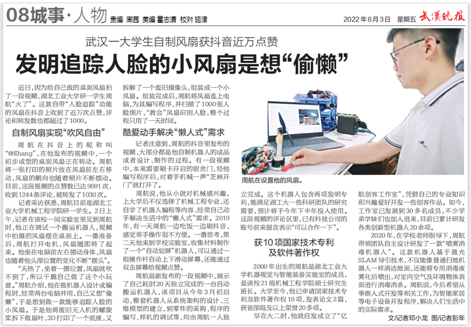
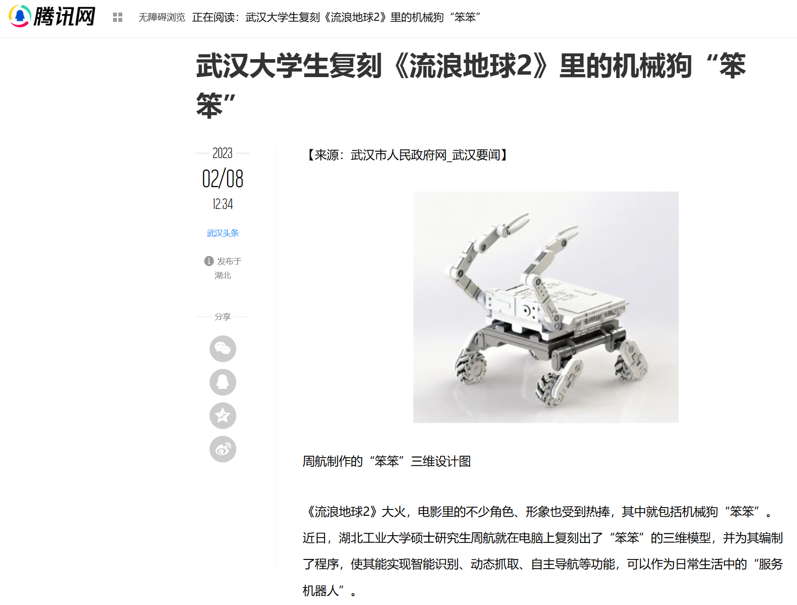
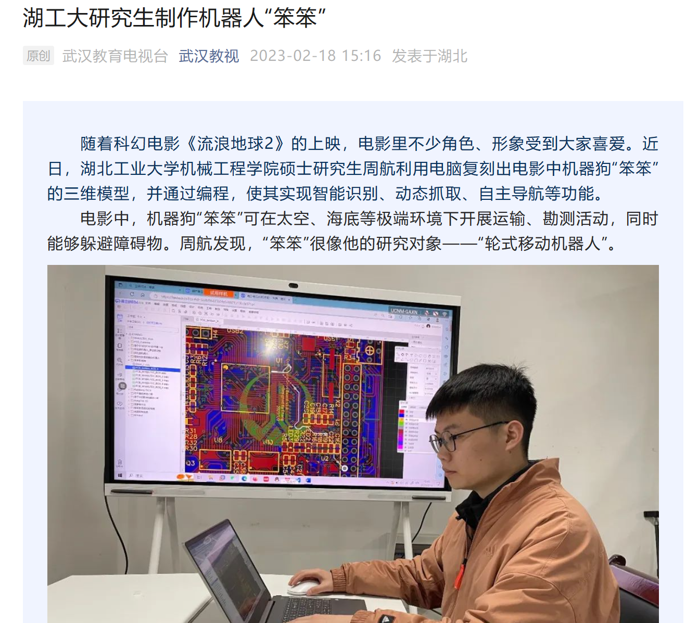

## 一、概述

> 对这些报道材料的看法：当初本人只是通过短视频分享一些自己的创客作品，能受到广大观众的喜欢并受到媒体的关注，很感谢他们，也给了我持续创新的动力。在这里仅仅是记录一下，我也会继续保持初心，埋头苦干！

个人科研成果被《人民日报》、《中国青年报》、《湖北日报》、《长江日报》、《湖北经视》、《湖工大新闻网》等权威媒体50余次报道，阅读量超100000余次。

## **二、代表性媒体报道情况**

| 序号 | 媒体名称         | 稿件名称                                                     | 稿件截图                                                   |
| ---- | ---------------- | ------------------------------------------------------------ | ---------------------------------------------------------- |
| 1    | 湖北经视         | [武汉一大学生复刻《流浪地球2》机械狗 从太空走进家庭](https://news.hbtv.com.cn/p/2363827.html) |    |
| 2    | 湖北综合         | [学以致用！大学生复刻《流浪地球2》机械狗“笨笨”](https://m.hbtv.com.cn/p/2363539.html) |    |
| 3    | 湖北公共         | [湖工大研究生制作机器人“笨笨”](https://news.hbut.edu.cn/info/1005/28216.htm) |    |
| 4    | 极目新闻         | [发明人脸追踪电风扇，做出《流浪地球》同款机械狗，武汉大学生发明多个“宝藏”小玩意](http://jms.ctdsb.net/jmythshare/#/news_detail?contentType=5&contentId=1677775&cId=0) |    |
| 5    | 长江日报         | [【大武汉客户端】武汉一大学生为“偷懒”自制风扇，为何抖音上近万人点赞？](https://news.hbut.edu.cn/info/1005/27100.htm) |    |
| 6    | 长江日报         | [学以致用！武汉大学生复刻《流浪地球2》机械狗“笨笨”](https://baijiahao.baidu.com/s?id=1757174620501006938&wfr=spider&for=pc) |    |
| 7    | 武汉晚报         | [武汉大学生复刻《流浪地球2》里的机械狗“笨笨”](http://whwb.cjn.cn/html/202304/18/node_73.htm) |    |
| 8    | 武汉晚报         | [武汉一大学生为“偷懒”自制风扇，为何抖音上近万人点赞？](http://whwb.cjn.cn/html/202304/18/node_73.htm) |    |
| 9    | 中国青年报       | [【中国青年报】00后大学生动手复刻《流浪地球2》机器狗“笨笨”](https://www.hbut.edu.cn/info/1046/29377.htm) |    |
| 10   | 人民日报  人民号 | [武汉一大学生为“偷懒”自制风扇，为何抖音上近万人点赞？](https://rmh.pdnews.cn/Pc/ArticleApi/lists) |  |
| 11   | 腾讯网           | [武汉大学生复刻《流浪地球2》里的机械狗“笨笨”](https://new.qq.com/rain/a/20230208A039MF00) |  |
| 12   | 武汉教育电视台   | [湖工大研究生制作机器人"笨笨"](http://app.whjyapp.com/)      |  |

