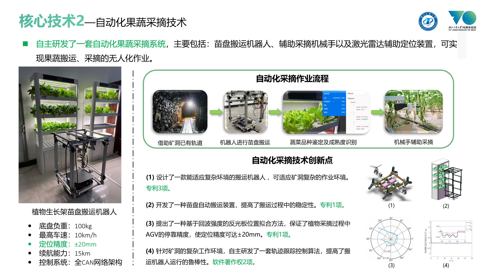
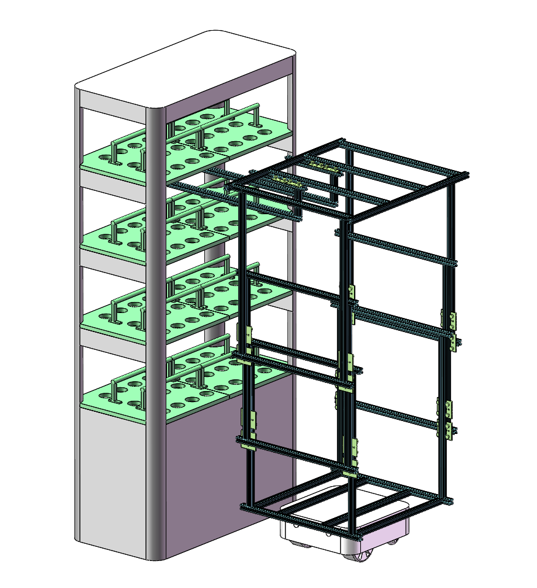
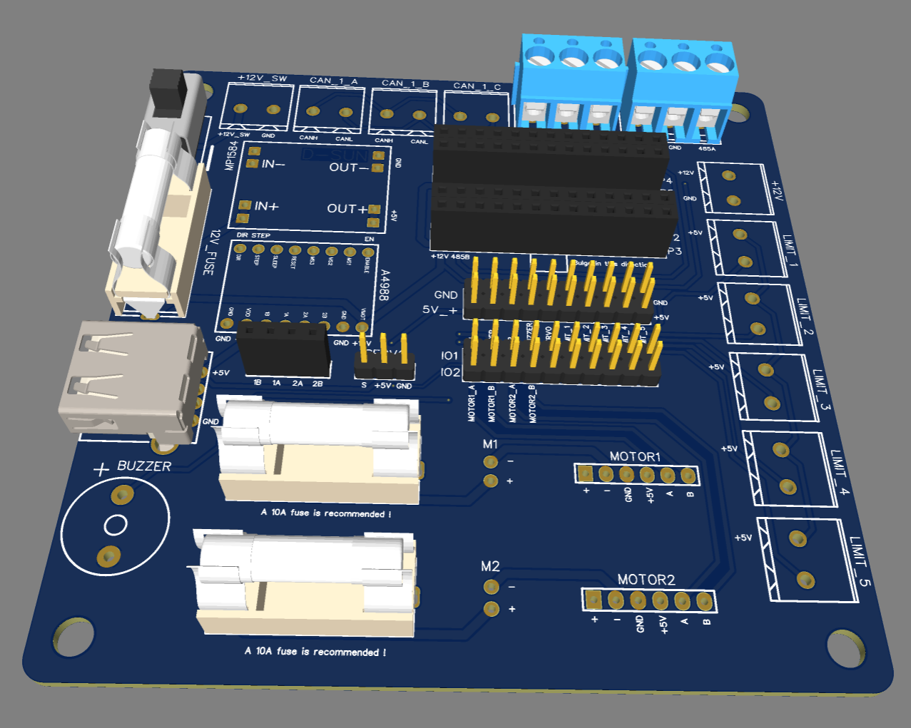
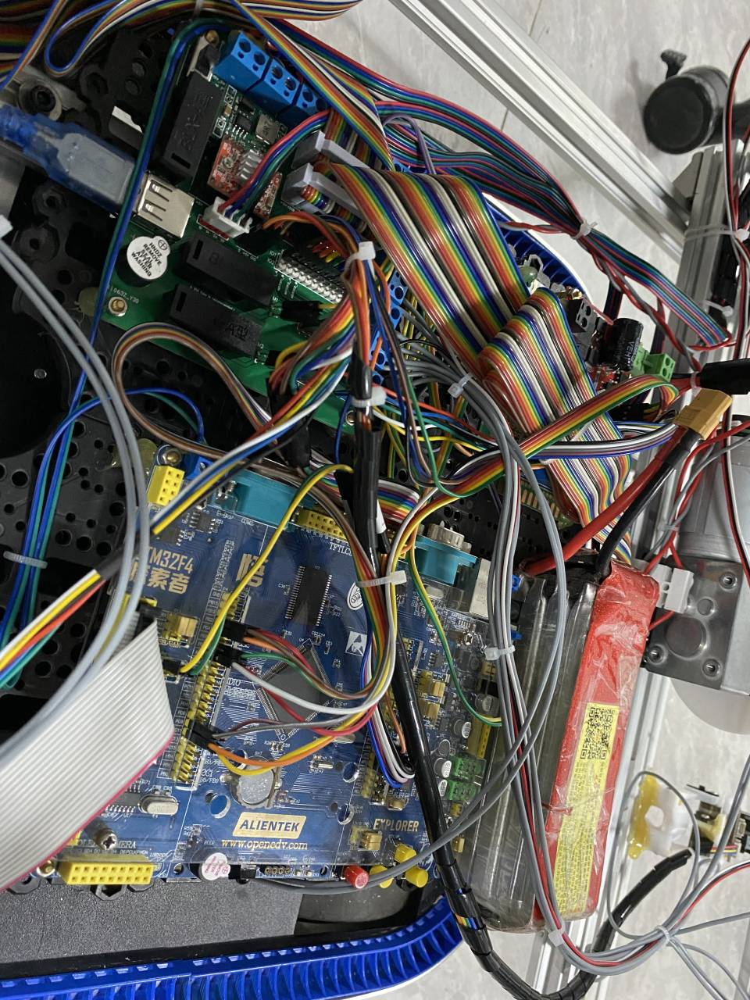
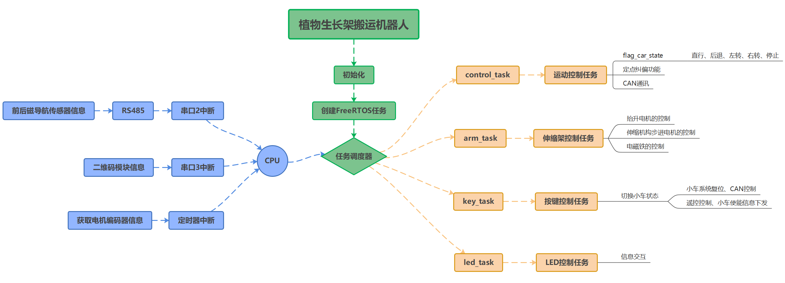

## 一、项目概述

- 2022年5月，研一下学期，导师安排这个项目由程师兄和我一起完成开发，当时考虑到师兄小论文压力较大，且嵌入式方面的开发经验较少（程师兄研究PLC的），**于是本人主动扛起了整个项目的开发任务。**🥰

- 此项目为**《湖北省重点研发计划项目》**中的一个分支，主要目标就是研发一款植物生长架苗盘搬运机器人，实现蔬菜的自动采摘、生长检测等任务。

- 这类项目又是本人喜欢的类型，从0到1，全栈式开发！系统架构设计、搬运方案敲定、导航方式选择、机械设计、硬件设计、软件设计一条龙，好在导师非常支持学生的自主创新。

------

> **开发目标：**黄石地区矿产丰富，同时废弃矿洞数量庞大，为了实现资源的充分利用，便开创了在矿井中种植青菜的新思路，植物生长苗盘搬运机器人主要用于蔬菜地自动化搬运，同时搭载作物生长环境检测节点。
>
> **负责事宜：**技术研发总工，负责导航架构设计、整机三维结构的设计及组装、控制系统的开发及调试、底层驱动板PCB设计、CAN\RS485总线报文处理、环境检测节点开发、QT上位机开发。
>
> **技术栈：**FreeRTOS、STM32、ESP32、QT、PCB、CAN、RS485、UART、MQTT
>
> **项目成果：**交付黄石某废弃矿洞使用。

## 二、系统架构

## 三、三维设计

菠菜的生长架一共有4层，要设计一款能伸缩的机构，当时的灵感来源于3D打印机的滑轨结构，以及吊车的大臂伸缩机构。整套三维结构迭代了两个版本，最终敲定的方案如下图所示，**还是秉承本人一贯的设计风格，所见即所得**，设计出来的方案可行性高，能快速购买零件完成组装，无需额外的定制化加工，最大程度上缩短了开发周期。

## 四、硬件设计

考虑到抬升机构采用的是两个24V的直流减速电机作为动力源，电流较大，所以在电路板上设计了3个10A的保险丝，担心因为硬件损坏耽误了项目进度。

前期验证过程中采用的是正点原子F4主控，后期产品交付时，采用了自己设计的最小系统板。

对于大功率电机，一定要做好光耦隔离，做好单独供电的方案设计。

## 五、软件设计

整套系统基于FreeRTOS实时操作系统设计，软件设计框架如下图所示，核心控制代码后期将分模块开源在Github上。整套系统软件层面的细节部分较多，会在【STM32开发探索】章节详细探讨。

## 六、磁导航效果

<iframe src="//player.bilibili.com/player.html?aid=768709575&bvid=BV13r4y1871S&cid=710260305&page=1" scrolling="no" border="0" frameborder="no" framespacing="0" allowfullscreen="true"> </iframe>

## 七、运行效果

【注：仅公开了实验室测试阶段的视频】

<iframe src="//player.bilibili.com/player.html?aid=825991589&bvid=BV1Gg4y1L7K4&cid=1122484282&page=1" scrolling="no" border="0" frameborder="no" framespacing="0" allowfullscreen="true"> </iframe>

## 八、项目总结

1. 项目整体难度不大，但是甲方催的紧，这个项目能在短时间内独立完成开发，主要得益于前期开发经验的积累。在移动机器人领域，拥有了较为完善的知识储备；
2. 积累了磁导航传感器的开发及调试经验，串口数据量较大情况下的处理思路；
3. 整套系统软件控制层面鲁棒性还不够，电路光耦隔离做的不太完善，控制信号容易受到干扰。
