## 一、项目概述

2021年11月，研一上学期，当时想着多做点项目，在一位土建学院学长的推荐下**（一次“挑战杯”国赛现场与这位学长认识的，说实话当时能得到学长的推荐，内心很开心）**，我便答应下来协助土建学院完成一台斜拉索桥梁缆索除冰机器人的开发。 结果现在项目得多做都做不过来~

2021年底期末考试前夕，与土建学院负责老师的第一次交谈：当时给我看了一个机器人在缆索上攀爬的视频，机器人正在进行缺陷检测及缆索除冰，他说国内做这一块儿的很少，这块儿国外的机器人比较先进，参考资料较少，是从0到1的过程，问我能不能搞？我当即就和负责老师分析了一下技术方案及可行性，**爽快地就答应了下来。**😎

经过详细沟通，土建学院那边对机器人相关的知识几乎不懂，所以我得承担起整机开发的所有任务，记得当时的梦想就是当全栈工程师，所有硬件软件全揽下来了。

> **开发目标：**本项目旨在研发一款针对桥梁斜拉索的探伤设备，在缆索上能实现自主行走、视觉缺陷检测、图像信息回传等功能。
>
> **负责事宜：**技术研发总工，负责整机三维结构的设计及组装、控制系统的开发及调试、底层驱动板PCB设计、YOLO_V5视觉检测、串口屏开发。
>
> **技术栈：**FreeRTOS、STM32、YOLO_V5、PCB、PPM、UART、IIC
>
> **项目成果：**一代机在2022年4月成功研发，并顺利攀登上“武汉长江二桥”的主缆。二代机正在开发中。授权发明专利一项。

## 二、三维结构设计

为了证明自己有实力能揽下这个项目，一周的时间内，迭代了三个版本的整机图纸。一代机工程机最终的模型敲定如下：

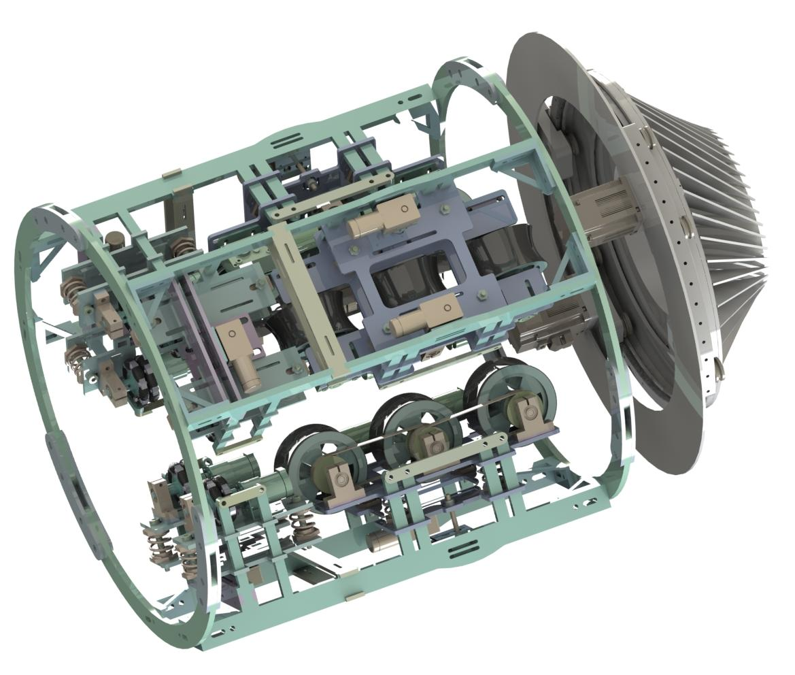

**【关键技术】**之所以能快速设计出机器的模型，源自于前期撰写专利及打比赛所积累的经验。设计出的模型所见即所得，所有结构的设计都需要考虑是否便于购买，是否需要额外机加工，以及零件的强度如何。因为是一代机，土建的老板也会有所顾虑，担心样机的测试能否顺利，所以不愿意花费太多的经费，相当于我试错的机会比较少，争取保证一次成功。

如三维模型所示，为了减轻整机重量及成本，全身采用玻璃纤维板雕刻而成，这种材料也是在ROBOCON中广泛使用的。其实用碳纤维更好，但是贵呀！

## 三、整机组装

### 3.1 主驱动轮组装

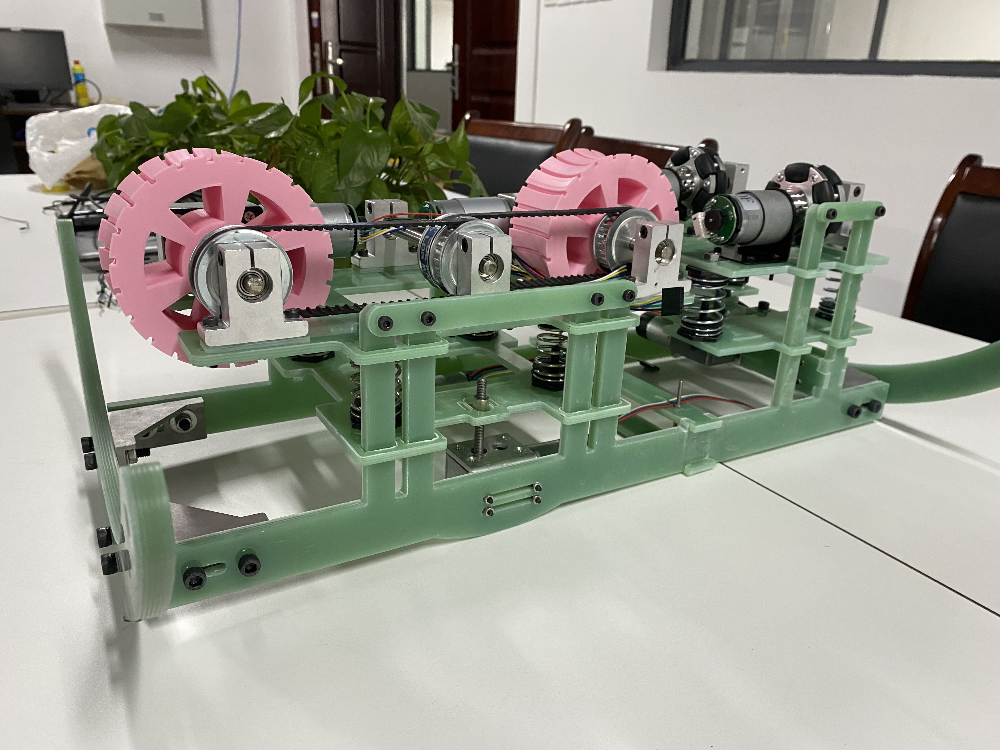

### 3.2 三边驱动轮合体

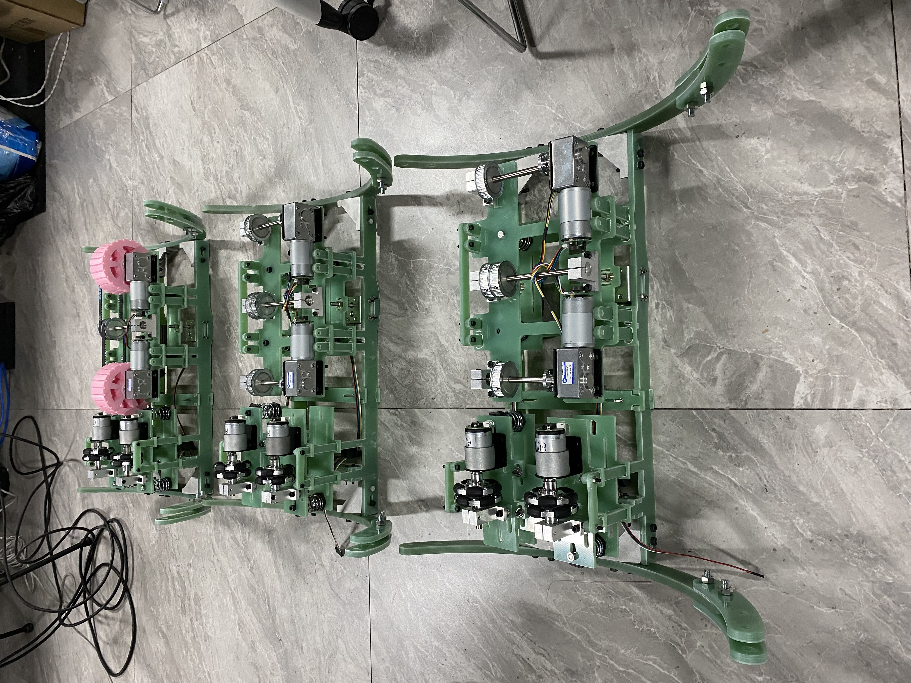

### 3.3 主驱动模块合拢

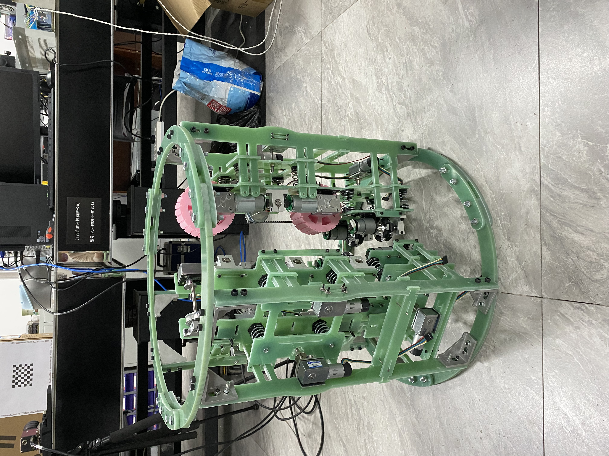

### 3.4 主动轮轮胎皮防滑处理

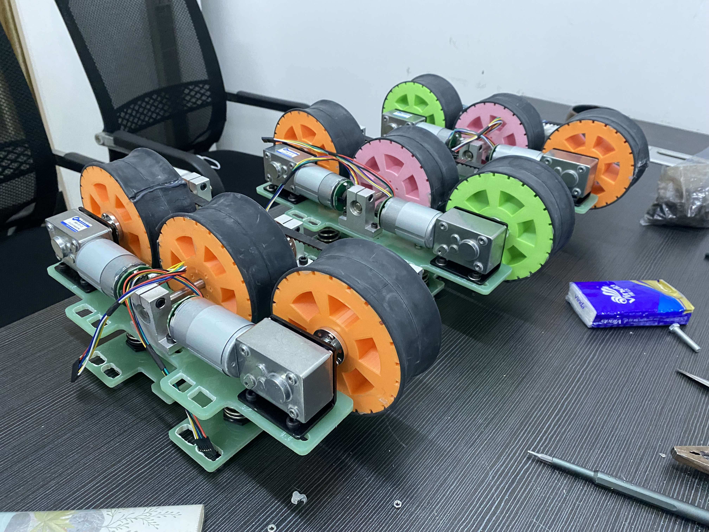

**【技术细节】**在三维模型设计的过程中就需要考虑是否好装配，上述地方其实设计的装配起来较为麻烦。自行车轮胎内胆皮也是当时的灵感来源，最后实战效果确实不错。整个车轮采用3D打印的结构。

**四、硬件电路设计**

### 4.1 主驱动轮电机闭环控制板

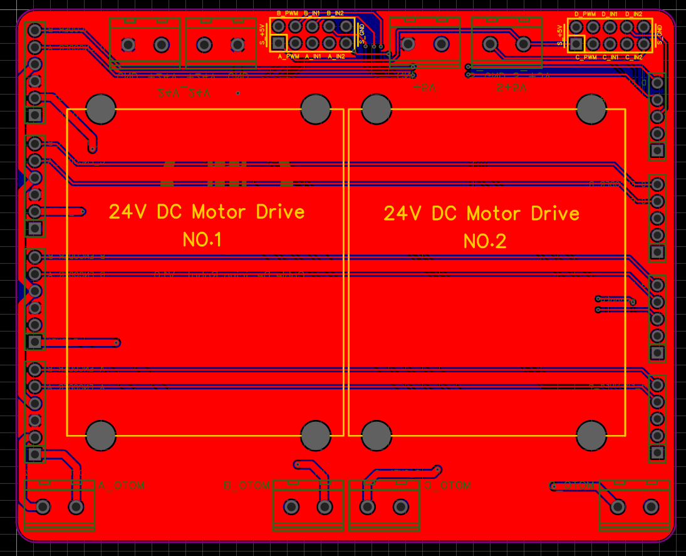

### 4.2 径向平衡装置电机闭环驱动板

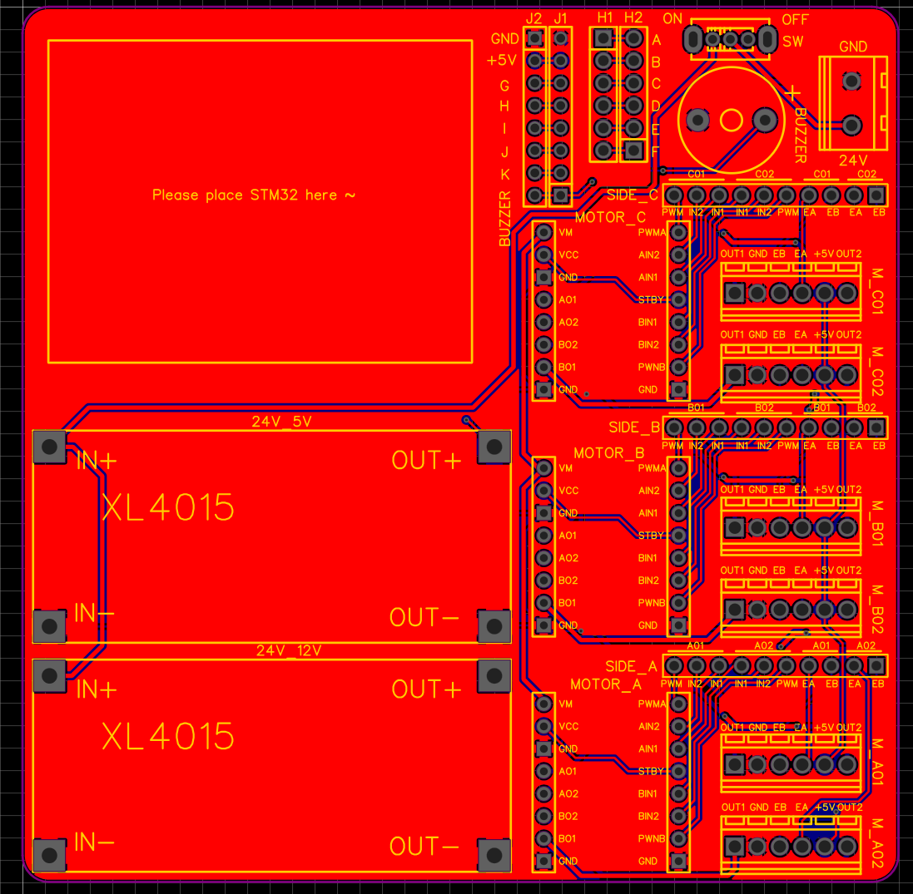

**【技术细节】**应为整套系统功率较大，电路板均采用模块化的设计。

## 五、软件设计

整套软件基于FreeRTOS操作系统编写，包含：电机驱动控制、IMU控制、航模遥控器控制、串口屏控制、环境检测、视觉识别等，代码后期会开源在Github上。

### 5.1 串口屏界面

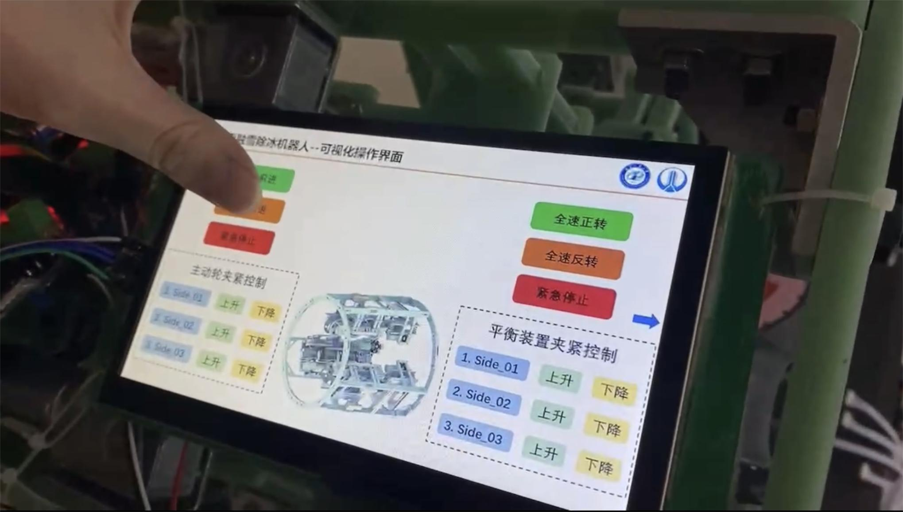

### 5.2 径向平衡装置实测

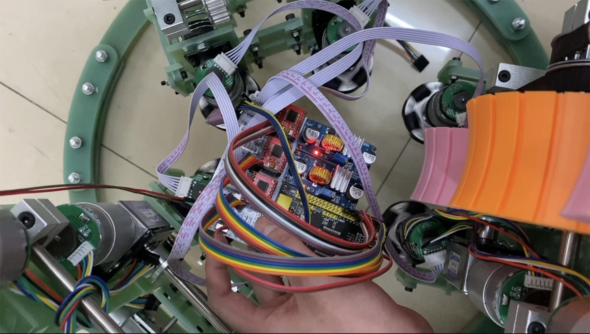

## 六、基于YOLO_V5的缆索缺陷检测

### 6.1 缆索缺陷数据集

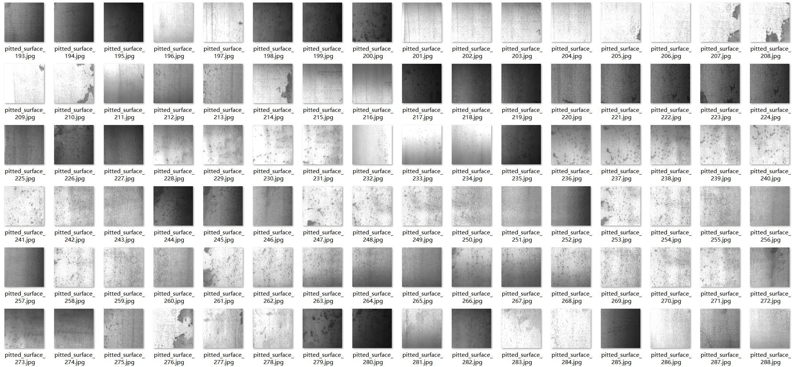

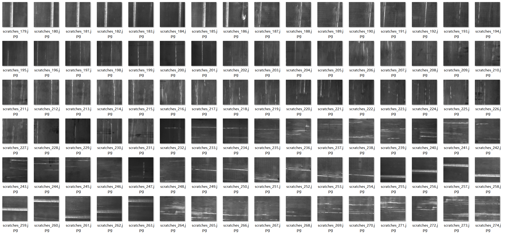

## 七、落地实验

### 7.1 武汉二七长江大桥实测

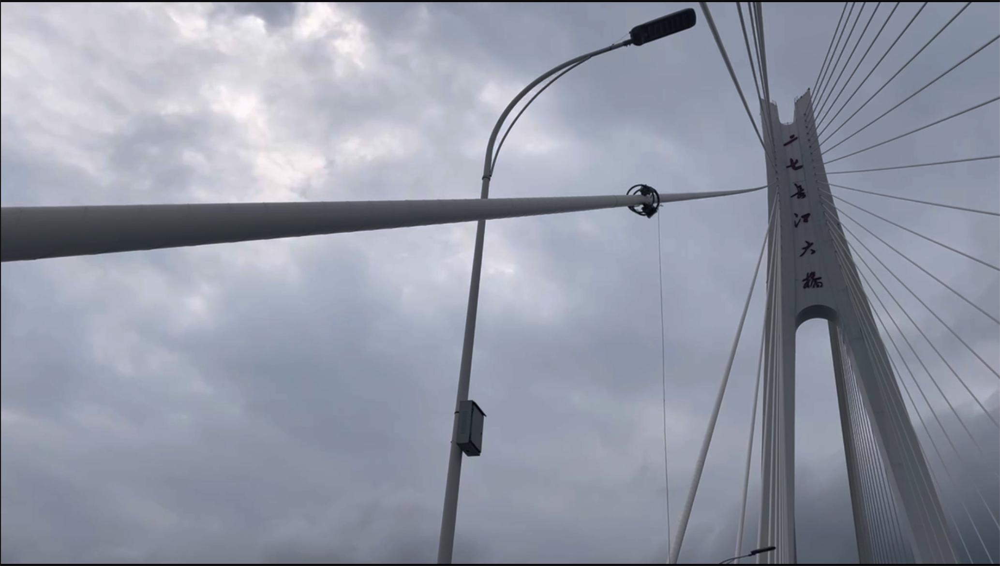

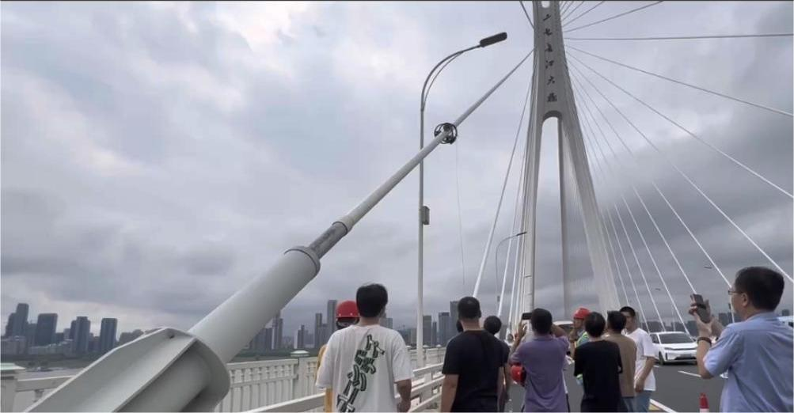
