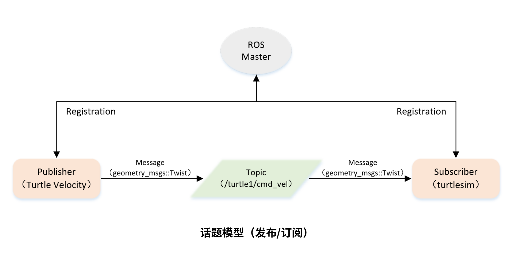

最后更新：2023年7月18日 | 阅读全文需8分钟

## 一、话题模型




## 二、创建发布者代码（C++）

```c++
/**
 * 该例程将发布turtle1/cmd_vel话题，消息类型geometry_msgs::Twist
 */
 
#include <ros/ros.h>
#include <geometry_msgs/Twist.h>

int main(int argc, char **argv)
{
	// ROS节点初始化
	ros::init(argc, argv, "velocity_publisher");

	// 创建节点句柄
	ros::NodeHandle n;

	// 创建一个Publisher，发布名为/turtle1/cmd_vel的topic，消息类型为geometry_msgs::Twist，队列长度10
	ros::Publisher turtle_vel_pub = n.advertise<geometry_msgs::Twist>("/turtle1/cmd_vel", 10);

	// 设置循环的频率
	ros::Rate loop_rate(10);

	int count = 0;
	while (ros::ok())
	{
	    // 初始化geometry_msgs::Twist类型的消息
		geometry_msgs::Twist vel_msg;
		vel_msg.linear.x = 0.5;
		vel_msg.angular.z = 0.2;

	    // 发布消息
		turtle_vel_pub.publish(vel_msg);
		ROS_INFO("Publsh turtle velocity command[%0.2f m/s, %0.2f rad/s]", 
				vel_msg.linear.x, vel_msg.angular.z);

	    // 按照循环频率延时
	    loop_rate.sleep();
	}

	return 0;
}

```


## 三、创建发布者代码（Python）

```python
# 该例程将发布turtle1/cmd_vel话题，消息类型geometry_msgs::Twist

import rospy
from geometry_msgs.msg import Twist

def velocity_publisher():
	# ROS节点初始化
    rospy.init_node('velocity_publisher', anonymous=True)

	# 创建一个Publisher，发布名为/turtle1/cmd_vel的topic，消息类型为geometry_msgs::Twist，队列长度10
    turtle_vel_pub = rospy.Publisher('/turtle1/cmd_vel', Twist, queue_size=10)

	#设置循环的频率
    rate = rospy.Rate(10) 

    while not rospy.is_shutdown():
		# 初始化geometry_msgs::Twist类型的消息
        vel_msg = Twist()
        vel_msg.linear.x = 0.5
        vel_msg.angular.z = 0.2

		# 发布消息
        turtle_vel_pub.publish(vel_msg)
    	rospy.loginfo("Publsh turtle velocity command[%0.2f m/s, %0.2f rad/s]", 
				vel_msg.linear.x, vel_msg.angular.z)

		# 按照循环频率延时
        rate.sleep()

if __name__ == '__main__':
    try:
        velocity_publisher()
    except rospy.ROSInterruptException:
        pass

```


联系笔者：ehangmaker@163.com
