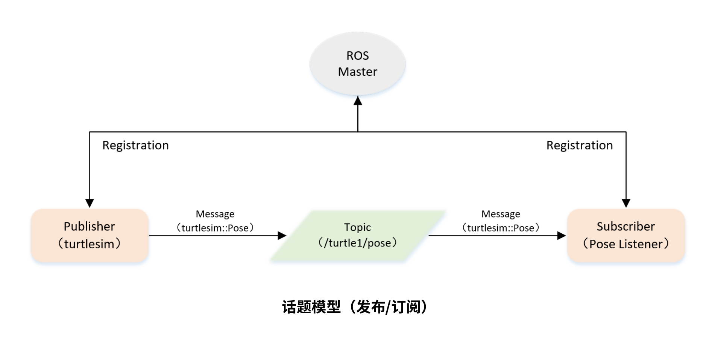

最后更新：2023年7月18日 | 阅读全文需8分钟


## 一、话题模型




## 二、创建订阅者代码（C++）

```c++
/**
 * 该例程将订阅/turtle1/pose话题，消息类型turtlesim::Pose
 */
 
#include <ros/ros.h>
#include "turtlesim/Pose.h"

// 接收到订阅的消息后，会进入消息回调函数
void poseCallback(const turtlesim::Pose::ConstPtr& msg)
{
    // 将接收到的消息打印出来
    ROS_INFO("Turtle pose: x:%0.6f, y:%0.6f", msg->x, msg->y);
}

int main(int argc, char **argv)
{
    // 初始化ROS节点
    ros::init(argc, argv, "pose_subscriber");

    // 创建节点句柄
    ros::NodeHandle n;

    // 创建一个Subscriber，订阅名为/turtle1/pose的topic，注册回调函数poseCallback
    ros::Subscriber pose_sub = n.subscribe("/turtle1/pose", 10, poseCallback);

    // 循环等待回调函数
    ros::spin();

    return 0;
}

```


## 三、创建订阅者代码（Python）

```python
# 该例程将订阅/turtle1/pose话题，消息类型turtlesim::Pose

import rospy
from turtlesim.msg import Pose

def poseCallback(msg):
    rospy.loginfo("Turtle pose: x:%0.6f, y:%0.6f", msg.x, msg.y)

def pose_subscriber():
	# ROS节点初始化
    rospy.init_node('pose_subscriber', anonymous=True)

	# 创建一个Subscriber，订阅名为/turtle1/pose的topic，注册回调函数poseCallback
    rospy.Subscriber("/turtle1/pose", Pose, poseCallback)

	# 循环等待回调函数
    rospy.spin()

if __name__ == '__main__':
    pose_subscriber()


```


联系笔者：ehangmaker@163.com
