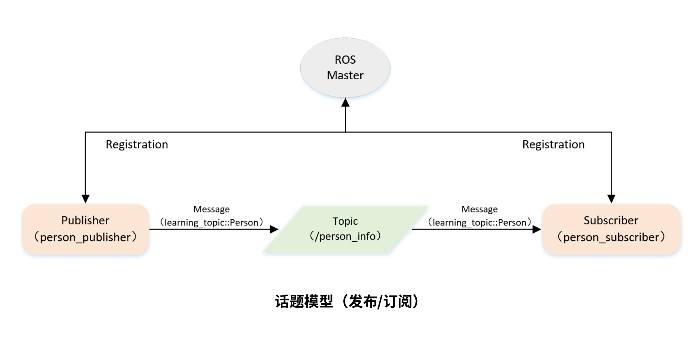
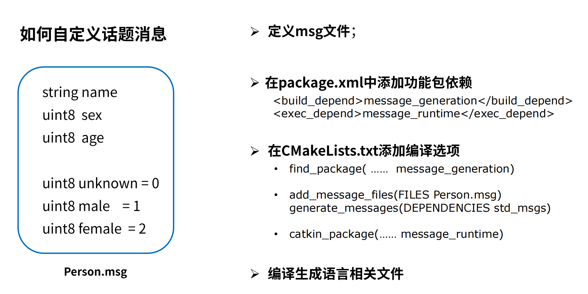

最后更新：2023年7月18日 | 阅读全文需8分钟


## 一、问题引入

> 在ROS开发中，ROS已定义好的消息类型无法满足开发要求，这时候可以自定义消息类型。


## 二、话题模型




## 三、数据接口的定义（msg）

```msg
string name
uint8  age
uint8  sex

uint8 unknown = 0
uint8 male    = 1
uint8 female  = 2
```




## 四、创建发布者代码（C++）

```c++
/**
 * 该例程将发布/person_info话题，自定义消息类型learning_topic::Person
 */
 
#include <ros/ros.h>
#include "learning_topic/Person.h"

int main(int argc, char **argv)
{
    // ROS节点初始化
    ros::init(argc, argv, "person_publisher");

    // 创建节点句柄
    ros::NodeHandle n;

    // 创建一个Publisher，发布名为/person_info的topic，消息类型为learning_topic::Person，队列长度10
    ros::Publisher person_info_pub = n.advertise<learning_topic::Person>("/person_info", 10);

    // 设置循环的频率
    ros::Rate loop_rate(1);

    int count = 0;
    while (ros::ok())
    {
        // 初始化learning_topic::Person类型的消息
    	learning_topic::Person person_msg;
		person_msg.name = "Tom";
		person_msg.age  = 18;
		person_msg.sex  = learning_topic::Person::male;

        // 发布消息
		person_info_pub.publish(person_msg);

       	ROS_INFO("Publish Person Info: name:%s  age:%d  sex:%d", 
				  person_msg.name.c_str(), person_msg.age, person_msg.sex);

        // 按照循环频率延时
        loop_rate.sleep();
    }

    return 0;
}

```


## 五、创建订阅者代码（C++）

```c++
/**
 * 该例程将订阅/person_info话题，自定义消息类型learning_topic::Person
 */
 
#include <ros/ros.h>
#include "learning_topic/Person.h"

// 接收到订阅的消息后，会进入消息回调函数
void personInfoCallback(const learning_topic::Person::ConstPtr& msg)
{
    // 将接收到的消息打印出来
    ROS_INFO("Subcribe Person Info: name:%s  age:%d  sex:%d", 
			 msg->name.c_str(), msg->age, msg->sex);
}

int main(int argc, char **argv)
{
    // 初始化ROS节点
    ros::init(argc, argv, "person_subscriber");

    // 创建节点句柄
    ros::NodeHandle n;

    // 创建一个Subscriber，订阅名为/person_info的topic，注册回调函数personInfoCallback
    ros::Subscriber person_info_sub = n.subscribe("/person_info", 10, personInfoCallback);

    // 循环等待回调函数
    ros::spin();

    return 0;
}

```


## 六、创建发布者代码（Python）

```python
# 该例程将发布/person_info话题，自定义消息类型learning_topic::Person

import rospy
from learning_topic.msg import Person

def velocity_publisher():
	# ROS节点初始化
    rospy.init_node('person_publisher', anonymous=True)

	# 创建一个Publisher，发布名为/person_info的topic，消息类型为learning_topic::Person，队列长度10
    person_info_pub = rospy.Publisher('/person_info', Person, queue_size=10)

	#设置循环的频率
    rate = rospy.Rate(10) 

    while not rospy.is_shutdown():
		# 初始化learning_topic::Person类型的消息
    	person_msg = Person()
    	person_msg.name = "Tom";
    	person_msg.age  = 18;
    	person_msg.sex  = Person.male;

		# 发布消息
        person_info_pub.publish(person_msg)
    	rospy.loginfo("Publsh person message[%s, %d, %d]", 
				person_msg.name, person_msg.age, person_msg.sex)

		# 按照循环频率延时
        rate.sleep()

if __name__ == '__main__':
    try:
        velocity_publisher()
    except rospy.ROSInterruptException:
        pass

```


## 七、创建订阅者代码（Python）

```python
# 该例程将订阅/person_info话题，自定义消息类型learning_topic::Person

import rospy
from learning_topic.msg import Person

def personInfoCallback(msg):
    rospy.loginfo("Subcribe Person Info: name:%s  age:%d  sex:%d", 
			 msg.name, msg.age, msg.sex)

def person_subscriber():
	# ROS节点初始化
    rospy.init_node('person_subscriber', anonymous=True)

	# 创建一个Subscriber，订阅名为/person_info的topic，注册回调函数personInfoCallback
    rospy.Subscriber("/person_info", Person, personInfoCallback)

	# 循环等待回调函数
    rospy.spin()

if __name__ == '__main__':
    person_subscriber()

```


联系笔者：ehangmaker@163.com

