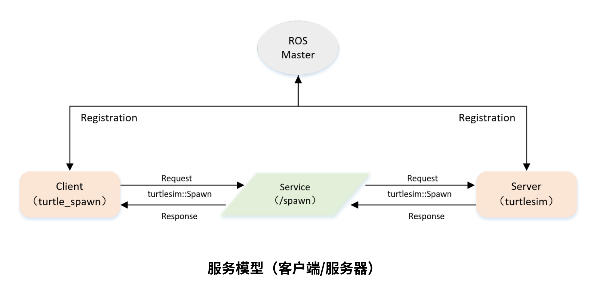

最后更新：2023年7月18日 | 阅读全文需8分钟


## 一、服务模型




## 二、创建客户端代码（C++）

```c++
/**
 * 该例程将请求/spawn服务，服务数据类型turtlesim::Spawn
 */

#include <ros/ros.h>
#include <turtlesim/Spawn.h>

int main(int argc, char** argv)
{
    // 初始化ROS节点
	ros::init(argc, argv, "turtle_spawn");

    // 创建节点句柄
	ros::NodeHandle node;

    // 发现/spawn服务后，创建一个服务客户端，连接名为/spawn的service
	ros::service::waitForService("/spawn");
	ros::ServiceClient add_turtle = node.serviceClient<turtlesim::Spawn>("/spawn");

    // 初始化turtlesim::Spawn的请求数据
	turtlesim::Spawn srv;
	srv.request.x = 2.0;
	srv.request.y = 2.0;
	srv.request.name = "turtle2";

    // 请求服务调用
	ROS_INFO("Call service to spwan turtle[x:%0.6f, y:%0.6f, name:%s]", 
			 srv.request.x, srv.request.y, srv.request.name.c_str());

	add_turtle.call(srv);

	// 显示服务调用结果
	ROS_INFO("Spwan turtle successfully [name:%s]", srv.response.name.c_str());

	return 0;
};

```


## 三、创建客户端代码（Python）

```python
# 该例程将请求/spawn服务，服务数据类型turtlesim::Spawn

import sys
import rospy
from turtlesim.srv import Spawn

def turtle_spawn():
	# ROS节点初始化
    rospy.init_node('turtle_spawn')

	# 发现/spawn服务后，创建一个服务客户端，连接名为/spawn的service
    rospy.wait_for_service('/spawn')
    try:
        add_turtle = rospy.ServiceProxy('/spawn', Spawn)

		# 请求服务调用，输入请求数据
        response = add_turtle(2.0, 2.0, 0.0, "turtle2")
        return response.name
    except rospy.ServiceException, e:
        print "Service call failed: %s"%e

if __name__ == "__main__":
	#服务调用并显示调用结果
    print "Spwan turtle successfully [name:%s]" %(turtle_spawn())


```


联系笔者：ehangmaker@163.com

