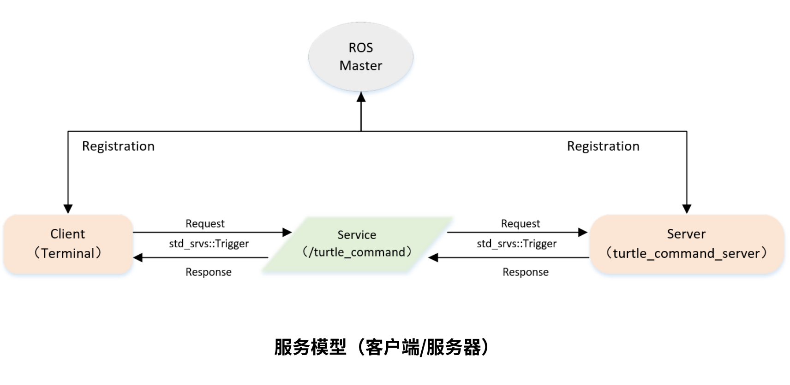

最后更新：2023年7月18日 | 阅读全文需8分钟


## 一、服务模型




## 二、创建客户端代码（C++）

```c++
/**
 * 该例程将执行/turtle_command服务，服务数据类型std_srvs/Trigger
 */
 
#include <ros/ros.h>
#include <geometry_msgs/Twist.h>
#include <std_srvs/Trigger.h>

ros::Publisher turtle_vel_pub;
bool pubCommand = false;

// service回调函数，输入参数req，输出参数res
bool commandCallback(std_srvs::Trigger::Request  &req,
         			std_srvs::Trigger::Response &res)
{
	pubCommand = !pubCommand;

    // 显示请求数据
    ROS_INFO("Publish turtle velocity command [%s]", pubCommand==true?"Yes":"No");

	// 设置反馈数据
	res.success = true;
	res.message = "Change turtle command state!"

    return true;
}

int main(int argc, char **argv)
{
    // ROS节点初始化
    ros::init(argc, argv, "turtle_command_server");

    // 创建节点句柄
    ros::NodeHandle n;

    // 创建一个名为/turtle_command的server，注册回调函数commandCallback
    ros::ServiceServer command_service = n.advertiseService("/turtle_command", commandCallback);

	// 创建一个Publisher，发布名为/turtle1/cmd_vel的topic，消息类型为geometry_msgs::Twist，队列长度10
	turtle_vel_pub = n.advertise<geometry_msgs::Twist>("/turtle1/cmd_vel", 10);

    // 循环等待回调函数
    ROS_INFO("Ready to receive turtle command.");

	// 设置循环的频率
	ros::Rate loop_rate(10);

	while(ros::ok())
	{
		// 查看一次回调函数队列
    	ros::spinOnce();
		
		// 如果标志为true，则发布速度指令
		if(pubCommand)
		{
			geometry_msgs::Twist vel_msg;
			vel_msg.linear.x = 0.5;
			vel_msg.angular.z = 0.2;
			turtle_vel_pub.publish(vel_msg);
		}

		//按照循环频率延时
	    loop_rate.sleep();
	}

    return 0;
}

```


## 三、创建客户端代码（Python）

```python
# 该例程将执行/turtle_command服务，服务数据类型std_srvs/Trigger

import rospy
import thread,time
from geometry_msgs.msg import Twist
from std_srvs.srv import Trigger, TriggerResponse

pubCommand = False;
turtle_vel_pub = rospy.Publisher('/turtle1/cmd_vel', Twist, queue_size=10)

def command_thread():	
	while True:
		if pubCommand:
			vel_msg = Twist()
			vel_msg.linear.x = 0.5
			vel_msg.angular.z = 0.2
			turtle_vel_pub.publish(vel_msg)
			
		time.sleep(0.1)

def commandCallback(req):
	global pubCommand
	pubCommand = bool(1-pubCommand)

	# 显示请求数据
	rospy.loginfo("Publish turtle velocity command![%d]", pubCommand)

	# 反馈数据
	return TriggerResponse(1, "Change turtle command state!")

def turtle_command_server():
	# ROS节点初始化
    rospy.init_node('turtle_command_server')

	# 创建一个名为/turtle_command的server，注册回调函数commandCallback
    s = rospy.Service('/turtle_command', Trigger, commandCallback)

	# 循环等待回调函数
    print "Ready to receive turtle command."

    thread.start_new_thread(command_thread, ())
    rospy.spin()

if __name__ == "__main__":
    turtle_command_server()

```


联系笔者：ehangmaker@163.com

