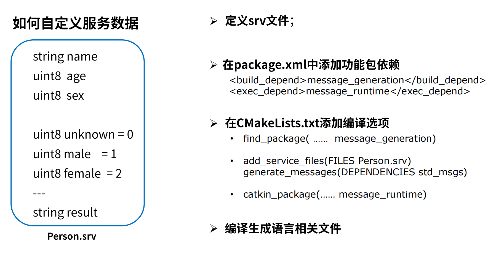

最后更新：2023年7月18日 | 阅读全文需8分钟


## 一、服务模型


## 二、自定义服务数据

```
string name
uint8  age
uint8  sex

uint8 unknown = 0
uint8 male    = 1
uint8 female  = 2

---
string result

```



## 三、创建客户端代码（C++）

```C++
/**
 * 该例程将请求/show_person服务，服务数据类型learning_service::Person
 */

#include <ros/ros.h>
#include "learning_service/Person.h"

int main(int argc, char** argv)
{
    // 初始化ROS节点
	ros::init(argc, argv, "person_client");

    // 创建节点句柄
	ros::NodeHandle node;

    // 发现/spawn服务后，创建一个服务客户端，连接名为/spawn的service
	ros::service::waitForService("/show_person");
	ros::ServiceClient person_client = node.serviceClient<learning_service::Person>("/show_person");

    // 初始化learning_service::Person的请求数据
	learning_service::Person srv;
	srv.request.name = "Tom";
	srv.request.age  = 20;
	srv.request.sex  = learning_service::Person::Request::male;

    // 请求服务调用
	ROS_INFO("Call service to show person[name:%s, age:%d, sex:%d]", 
			 srv.request.name.c_str(), srv.request.age, srv.request.sex);

	person_client.call(srv);

	// 显示服务调用结果
	ROS_INFO("Show person result : %s", srv.response.result.c_str());

	return 0;
};

```


## 四、创建服务端代码（C++）

```C++
/**
 * 该例程将执行/show_person服务，服务数据类型learning_service::Person
 */
 
#include <ros/ros.h>
#include "learning_service/Person.h"

// service回调函数，输入参数req，输出参数res
bool personCallback(learning_service::Person::Request  &req,
         			learning_service::Person::Response &res)
{
    // 显示请求数据
    ROS_INFO("Person: name:%s  age:%d  sex:%d", req.name.c_str(), req.age, req.sex);

	// 设置反馈数据
	res.result = "OK";

    return true;
}

int main(int argc, char **argv)
{
    // ROS节点初始化
    ros::init(argc, argv, "person_server");

    // 创建节点句柄
    ros::NodeHandle n;

    // 创建一个名为/show_person的server，注册回调函数personCallback
    ros::ServiceServer person_service = n.advertiseService("/show_person", personCallback);

    // 循环等待回调函数
    ROS_INFO("Ready to show person informtion.");
    ros::spin();

    return 0;
}

```


## 五、创建客户端代码（Python）

```python
# 该例程将请求/show_person服务，服务数据类型learning_service::Person

import sys
import rospy
from learning_service.srv import Person, PersonRequest

def person_client():
	# ROS节点初始化
    rospy.init_node('person_client')

	# 发现/spawn服务后，创建一个服务客户端，连接名为/spawn的service
    rospy.wait_for_service('/show_person')
    try:
        person_client = rospy.ServiceProxy('/show_person', Person)

		# 请求服务调用，输入请求数据
        response = person_client("Tom", 20, PersonRequest.male)
        return response.result
    except rospy.ServiceException, e:
        print "Service call failed: %s"%e

if __name__ == "__main__":
	#服务调用并显示调用结果
    print "Show person result : %s" %(person_client())

```


## 六、创建服务端代码（Python）

```python
# 该例程将执行/show_person服务，服务数据类型learning_service::Person

import rospy
from learning_service.srv import Person, PersonResponse

def personCallback(req):
	# 显示请求数据
    rospy.loginfo("Person: name:%s  age:%d  sex:%d", req.name, req.age, req.sex)

	# 反馈数据
    return PersonResponse("OK")

def person_server():
	# ROS节点初始化
    rospy.init_node('person_server')

	# 创建一个名为/show_person的server，注册回调函数personCallback
    s = rospy.Service('/show_person', Person, personCallback)

	# 循环等待回调函数
    print "Ready to show person informtion."
    rospy.spin()

if __name__ == "__main__":
    person_server()

```


联系笔者：ehangmaker@163.com

