最后更新：2023年1月30日 | 阅读全文需10分钟

## 一、问题引入

> 当我们在ROS中进行移动机器人**实物仿真实验**的时候，需要为其提供一个合适的场景地图，供其在虚拟地图中完成**栅格地图构建**、**特征匹配**以及**自主导航**等任务。


针对不同的实验目的，对场景地图的要求也会有很大的区别，例如：

1. **在路径规划实验中**，为了验证算法的鲁棒性，需要在地图中设置一些较为复杂的障碍物，或者使障碍物的面积在整个场景中占比较大，甚至必要时需要增加动态障碍物；
2. **在二次定位实验中**，需要在场景中设置特殊形状的障碍物；
3. **在轨迹跟踪实验中**，需要预留一块较为空旷的场地让机器人在上面运行。


基于ROS/Gazebo的强大物理引擎，它能非常真实的模拟出现实世界中的运动现象，并且综合上述分析，读者是不是会觉得不用搭建实物机器人，直接在ROS中进行实验更为方便呢？实时也是如此，在一些外文期刊中，在ROS中的实物仿真实验也会被编辑部认可！


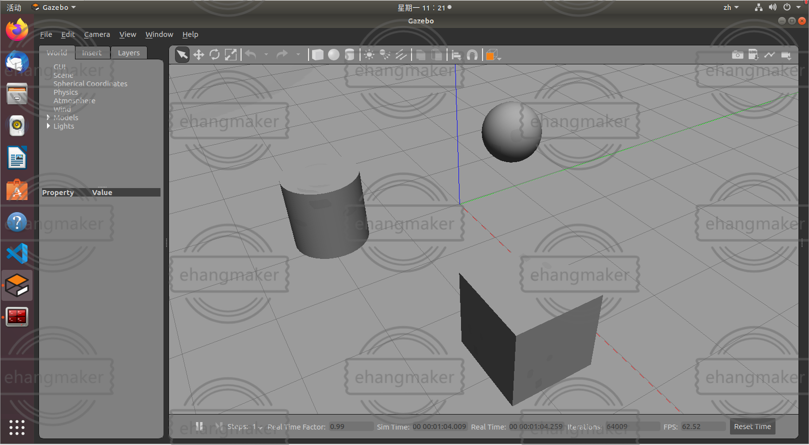


ROS/Gazebo的界面如上图所示，其软件中自带了一些物体素材，同时可以导入一些外部库来增加物体素材，软件中还具有自定义墙体、楼梯、房门等功能。


> 核心问题：软件中的一些功能似乎操作起来不太友好（也可能是我没有玩明白**😄**），特别是在建立场景地图的时候，不能随心所欲的建造出任意形状的障碍物，任意弧度的曲线。


## 二、解决方案

### 2.1 在Solidworks中创建地图模型

1. 在SW的**零件图绘制模式**下，按照实际尺寸绘制出自己想要的地图形状，本文以下图为例：

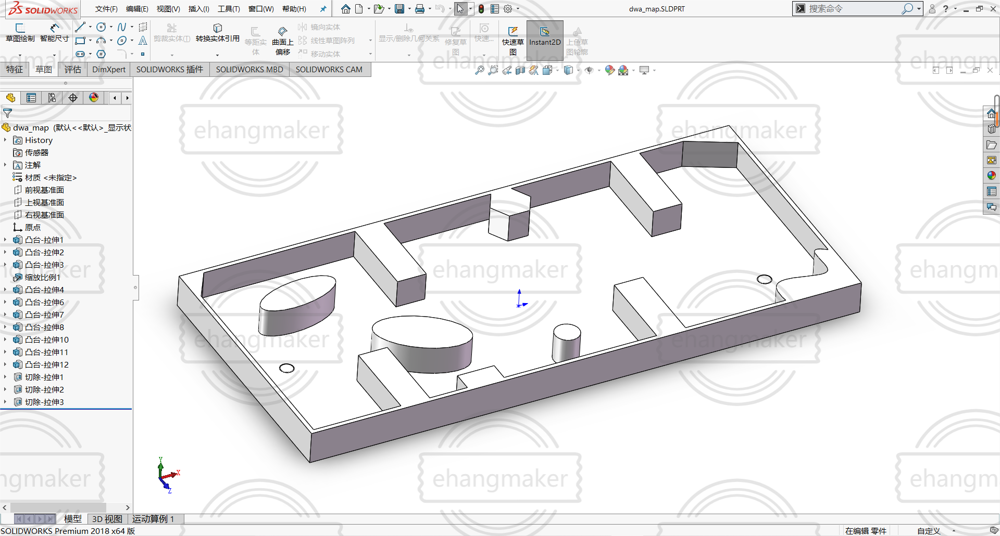

2. 保存【第一步所绘制的零件图】，以英文命名，接下来新建一个装配体，进入**装配体绘制模式**，插入【第一步所绘制的零件图】，以英文名保存：

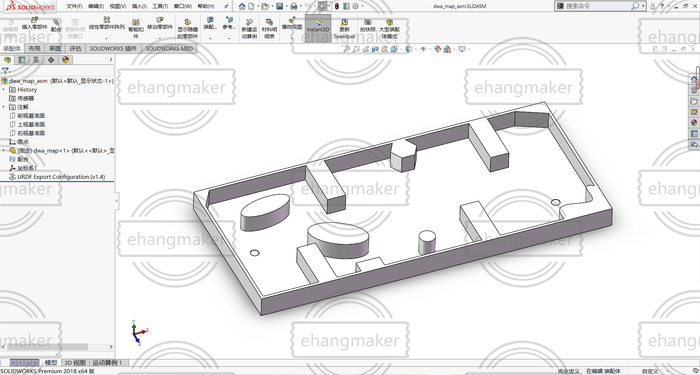


3. 接下来的操作均在**装配体绘制模式**下进行，建立一个原点坐标系，步骤：装配体——参考几何体——坐标系：

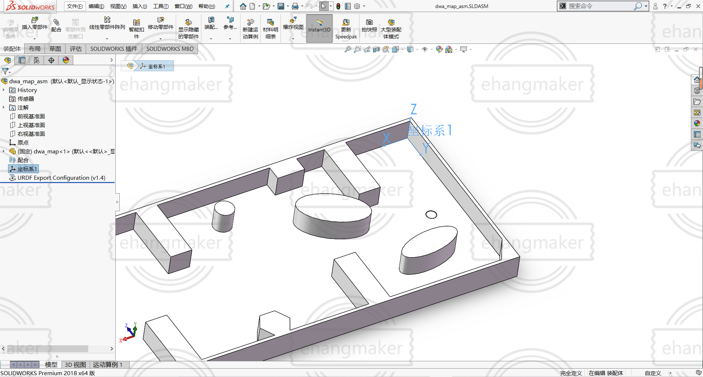

4. 下载[sw_urdf_exporter插件](https://github.com/ros/solidworks_urdf_exporter/releases)，安装插件之前确保读者电脑中的SW已正常安装，点击插件中的可执行文件（sw2urdfSetup.exe）即可完成插件的安装。安装完成后，在工具——File中即可找到：

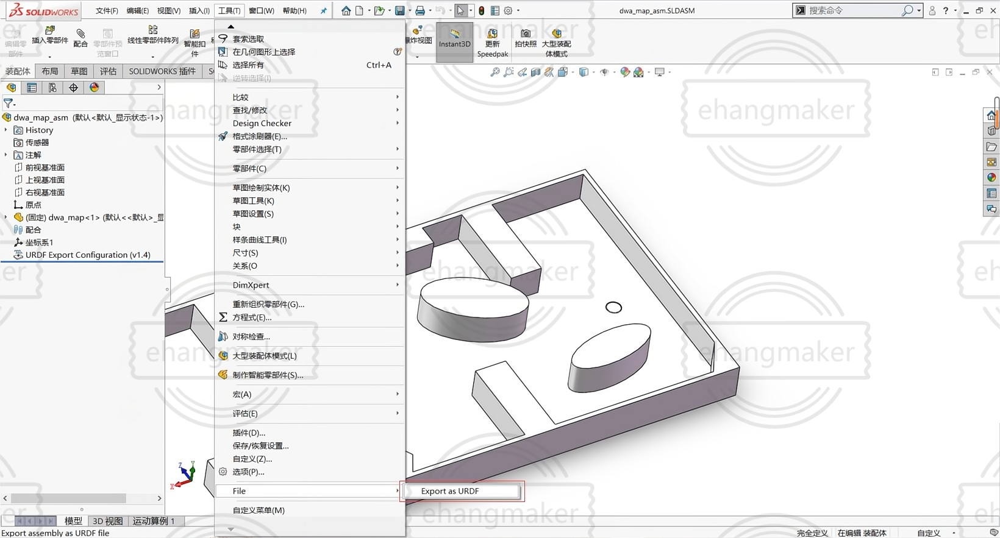

5. 点击插件的Export as URDF，按照下图所述的配置进行操作：

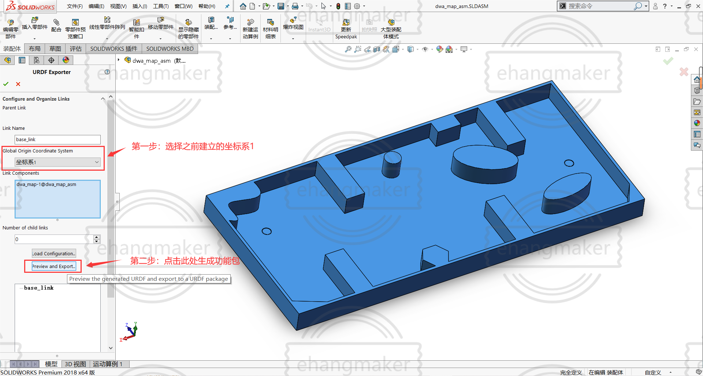

6. 接下来会生成一个文件夹，仔细观察文件夹中的内容可发现，它就是ROS中的一个功能包，还具有launch文件：

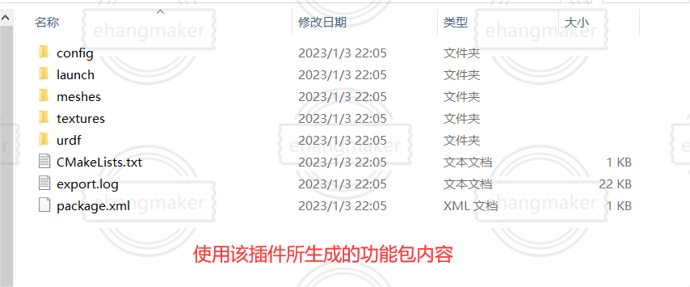

7. 注意事项：在SW进行上述操作的时候，一定要严格按照步骤来，特别是生成URDF的这个插件是在**装配体模式**下运行的，在**零件图模式**下是无法运行该插件的；设置原点坐标系过后，在使用该插件时，要选中该坐标系；所有尽量用英文命名，因为到时候需要在ROS中运行的。


### 2.2 在ROS/Gazebo中生成场景地图

1. 将上述插件所生成的功能包放在ROS的工作空间中，并编译：

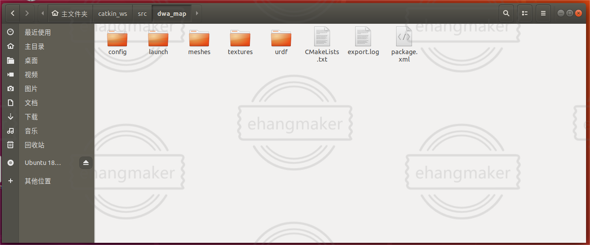

2.启动Gazebo查看地图：

```C
roslaunch dwa_map gazebo.launch
```

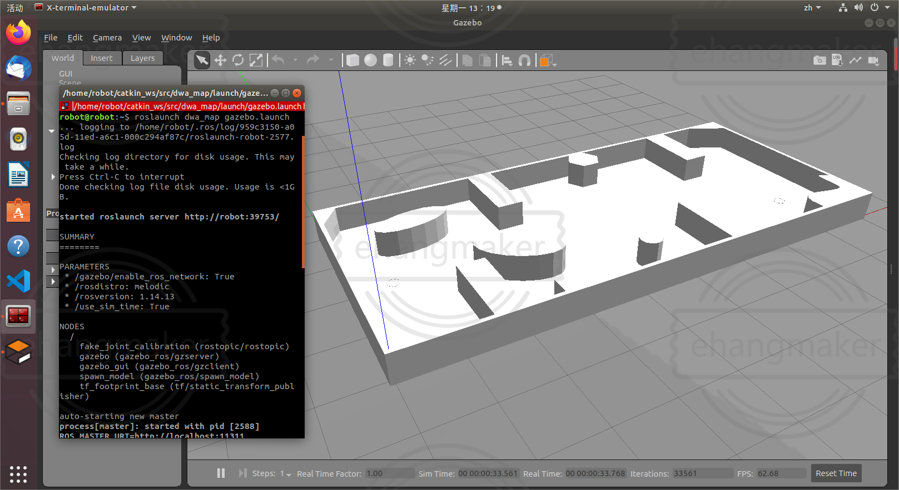

3.在Gazebo软件中，将该文件另存为.world文件，文件内容如下：

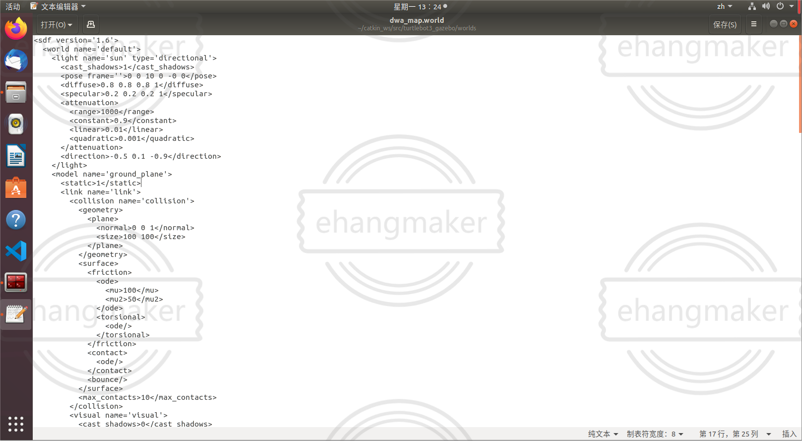

4. 得到了Gazebo中环境的.world文件就好办了，可以基于该地图文件做一系列的实物仿真实验，比如说可以可以用来建立2D地图：

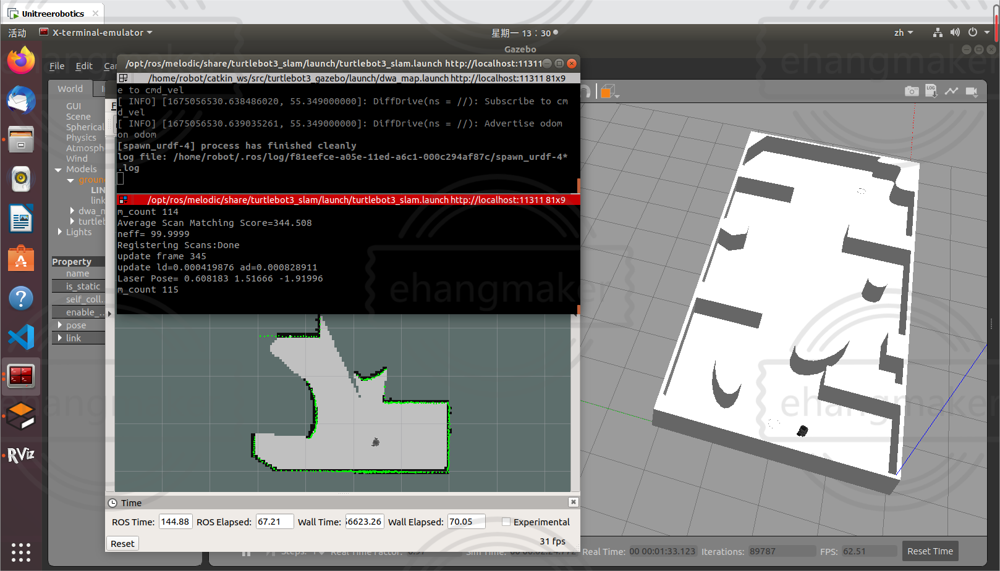

5. 建立好的栅格地图如下图所示：

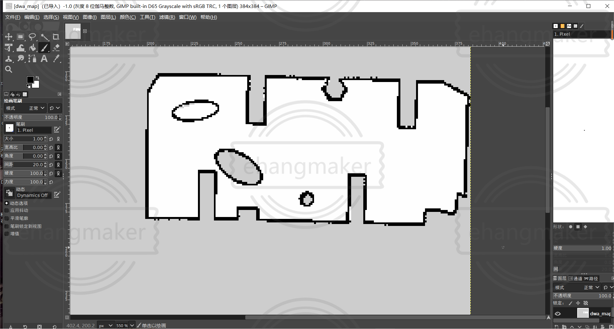


## 三、全文小结

> 将上述方法浏览完毕，您似乎才会感觉到此方法的巧妙之处。针对复杂的模型如果通过直接纯手写URDF的办法并不可取，直接通过插入Gazebo中的物体元素的方法也较难满足需求，使用上述方法能帮您快速构建一个属于自己的创意空间，让移动机器人在上面愉快地运行。😉


联系笔者：ehangmaker@163.com
