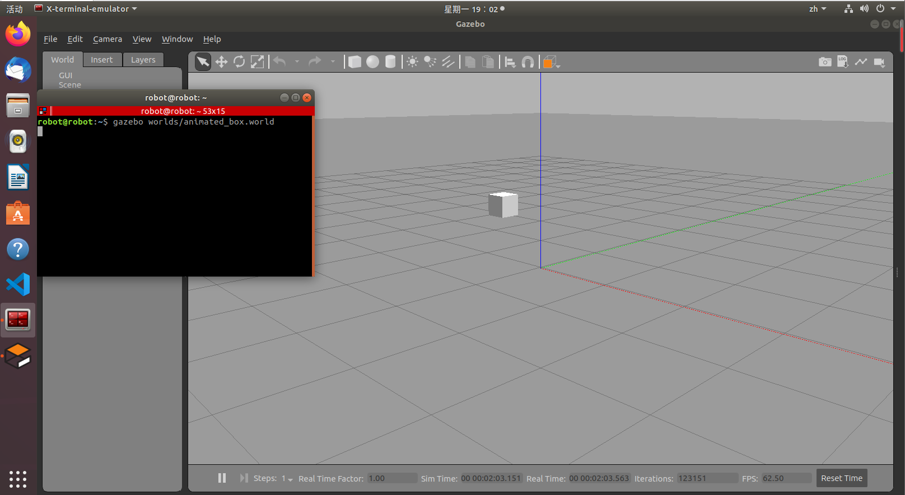
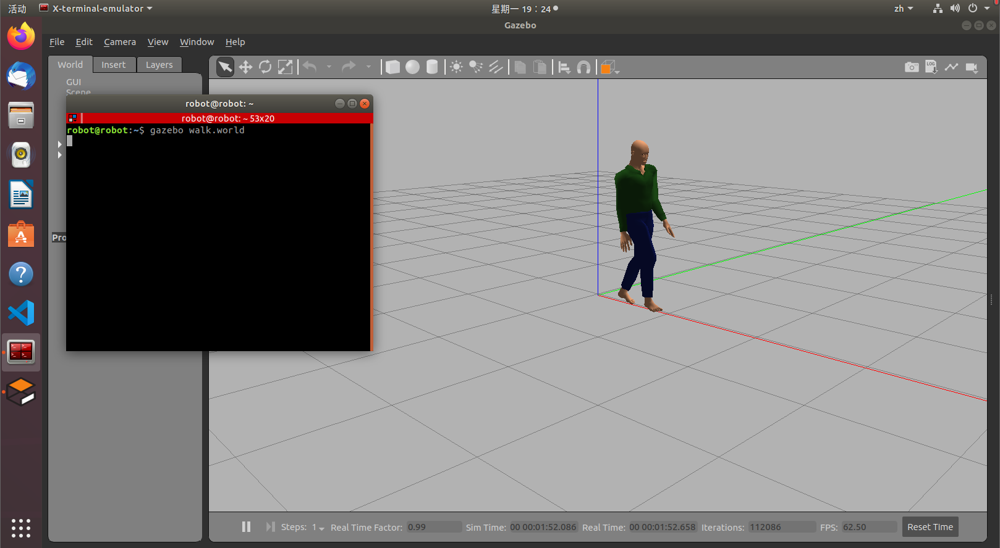
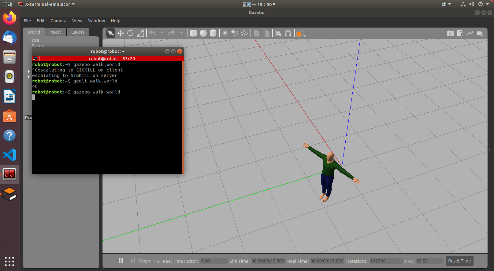
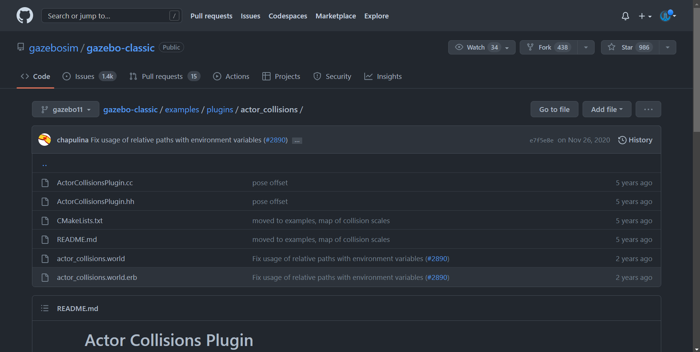
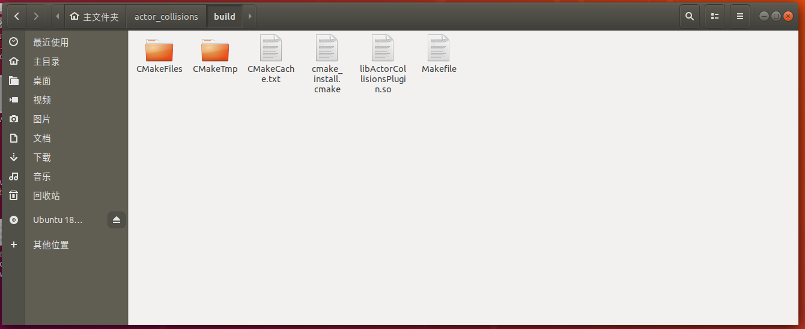
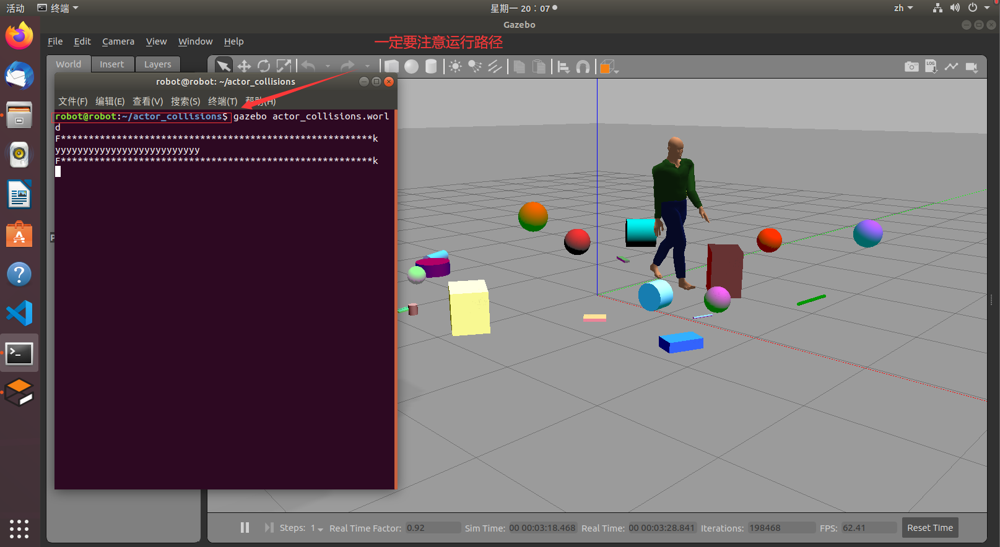

最后更新：2023年1月30日 | 阅读全文需13分钟

## 一、问题引入

> 当我们开发出一个新的**局部路径规划算法**时，需要尽快对其性能进行综合评估，这时选择在ROS/Gazebo的环境下进行测试无疑是最为便捷的方案。在对**局部路径规划算法**进行测试的过程中，针对**途径动态障碍物**时的**避障性能**考察也是十分重要的一环。


> 问题指出：在Gazebo中添加动态障碍物或许并非难事，但笔者在添加完动态障碍物后，出现了2D激光雷达无法对其进行识别的情况，添加后的动态障碍物似乎像幽灵一般在空中漂浮，无法对机器人或者周围环境产生碰撞，这样一来它就称不上对障碍物进行了避障。针对此问题，笔者进行了探究，解决过程也是较为坎坷，从而将解决方法记载如下：
>


## 二、在Gazebo中添加动态障碍物

> 本文实验环境：虚拟机 + ROS_Melodic + Gazebo9 + RViz + Turtlebot3
>
> （不同的版本在操作上可能有细微的区别）


### 2.1 方形动态障碍物

1. 在ROS中运行下述命令可以看见一个悬空的正方块在空中移动：

```c
gazebo worlds/animated_box.world
```




2. 运行该命令，你会看到一个漂浮的方块一次又一次地以方形轨迹移动，轨迹经过world中的四个点（四个点的坐标分别为：[-1,-1,1]、[-1,1,1]、[1,1,1]、[1,-1,1]），它们之间需要 1 秒的间隔，其控制源码如下：

```xml
<?xml version="1.0" ?>
<sdf version="1.6">
   <world name="default">
      <include>
         <uri>model://ground_plane</uri>
      </include>
      <include>
         <uri>model://sun</uri>
      </include>
      <actor name="animated_box">
        <link name="box_link">
          <visual name="visual">
            <geometry>
              <box>
                <size>.2 .2 .2</size>
              </box>
            </geometry>
          </visual>
        </link>
        <script>
          <loop>true</loop>
          <auto_start>true</auto_start>
          <trajectory id="0" type="square">
             <waypoint>
                <time>0.0</time>
                <pose>-1 -1 1 0 0 0</pose>
             </waypoint>
             <waypoint>
                <time>1.0</time>
                <pose>-1 1 1 0 0 0</pose>
             </waypoint>
             <waypoint>
                <time>2.0</time>
                <pose>1 1 1 0 0 0</pose>
             </waypoint>
             <waypoint>
                <time>3.0</time>
                <pose>1 -1 1 0 0 0</pose>
             </waypoint>
             <waypoint>
                <time>4.0</time>
                <pose>-1 -1 1 0 0 0</pose>
             </waypoint>
          </trajectory>
        </script>
      </actor>
   </world>
</sdf>
```


### 2.2 人形动态障碍物

1. 打开一个新的命令行，创建新的world，输入：

```c
gedit walk.world
```

2. 放入下述代码到walk.world中：

```xml
<?xml version="1.0" ?>
<sdf version="1.6">
  <world name="default">
    <include>
      <uri>model://sun</uri>
    </include>
    <actor name="actor">
      <skin>
        <filename>walk.dae</filename>
      </skin>
    </actor>
  </world>
</sdf>
```

3. 在ROS中运行下述命令可以看见一个行人在空地中行走：

```c
gazebo walk.world
```



4. 至此，您已经了解有关创建轨迹和加载静态动画，是时候学习如何将它们结合起来了。此时我们将walk.world中的代码替换如下：

```XML
<sdf version="1.6">
  <world name="default">
    <include>
      <uri>model://sun</uri>
    </include>
    <actor name="actor">
      <skin>
        <filename>walk.dae</filename>
      </skin>
      <animation name="animation">
        <filename>walk.dae</filename>
      </animation>
      <script>
        <trajectory id="0" type="walking">
          <waypoint>
            <time>0</time>
            <pose>0 2 0 0 0 -1.57</pose>
          </waypoint>
          <waypoint>
            <time>2</time>
            <pose>0 -2 0 0 0 -1.57</pose>
          </waypoint>
          <waypoint>
            <time>2.5</time>
            <pose>0 -2 0 0 0 1.57</pose>
          </waypoint>
          <waypoint>
            <time>7</time>
            <pose>0 2 0 0 0 1.57</pose>
          </waypoint>
          <waypoint>
            <time>7.5</time>
            <pose>0 2 0 0 0 -1.57</pose>
          </waypoint>
        </trajectory>
      </script>
    </actor>
  </world>
</sdf>
```

5. 运行下述指令可以看到行人按照设定轨迹进行运行：

```c
gazebo walk.world
```




> 研究上述代码不难看出，在Gazebo中增加动态障碍物并不难，使用actor标签即可，难点在于下文中为动态障碍物赋予碰撞属性。


## 三、为动态障碍物赋予碰撞属性（collisions）


> 参照Gazebo官方给出的增加actor标签的方法，依此类推，笔者在自己的.world文件中同样添加了actor标签，一切准备就绪后，直到运行了RViz才发现了问题所在，激光雷达无法识别刚才添加的动态障碍物，经过一系列测试，发现移动机器人turtlebot3与动态障碍物根本没有产生碰撞。 找出问题后，相当于只要给动态障碍物添加碰撞属性即可解决。

1. [下载官方插件包](https://github.com/gazebosim/gazebo-classic/tree/gazebo11/examples/plugins/actor_collisions)



2. 按照Github给出的方法编译碰撞插件

```c
mkdir build
cd build
cmake ..
make
```

3. ROS中编译后内容如下：



4. 执行下述命令将编译好的插件拷贝至Gazebo的插件目录当中：

```c
sudo cp libActorCollisionsPlugin.so /usr/lib/x86_64-linux-gnu/gazebo-9/plugins
```

5. 【重点】一定要把下面这行代码放在.bashrc的配置文件中，不然ROS找不到该插件：（代码中的路径需要结合读者情况进行修改）

```xml
export GAZEBO_PLUGIN_PATH=~/catkin_ws/devel/lib:${GAZEBO_PLUGIN_PATH}
```

6. 测试插件的实际运行效果：

```c
gazebo actor_collisions.world
```



7. 查看actor_collisions.world文件夹里面的内容，举一反三。

## 四、实际避障效果演示

<div class="bilibili">
    <iframe src="//player.bilibili.com/player.html?aid=778152802&bvid=BV1Ay4y1d7hc&cid=974987548&page=1
    &high_quality=1" 
    scrolling="no" border="0" frameborder="no" framespacing="0" allowfullscreen="true"> </iframe>
</div>


## 五、参考链接

1. [gazebo之actor标签行人添加碰撞属性](https://blog.csdn.net/allenhsu6/article/details/114068662?spm=1001.2014.3001.5506)
2. [流下没技术的眼泪之gazebo actor collision解决过程](https://blog.csdn.net/tanjia6999/article/details/102629735?spm=1001.2014.3001.5506)
3. [在Gazebo中添加动态障碍物](https://robkin.blog.csdn.net/article/details/128203687)
4. [Gazebo官网](https://classic.gazebosim.org/tutorials?tut=actor&cat=build_robot)


联系笔者：ehangmaker@163.com
