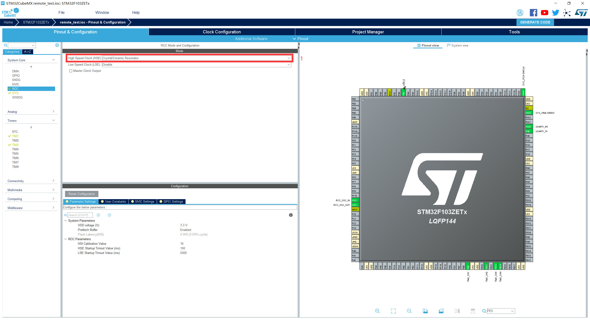
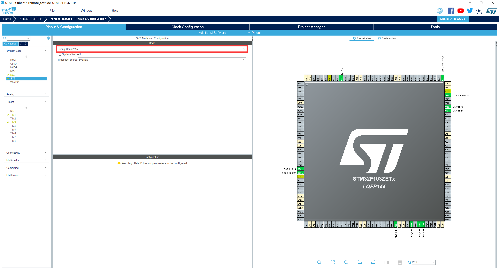
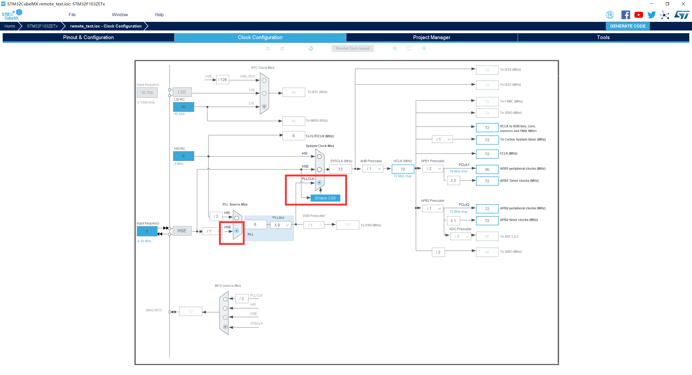
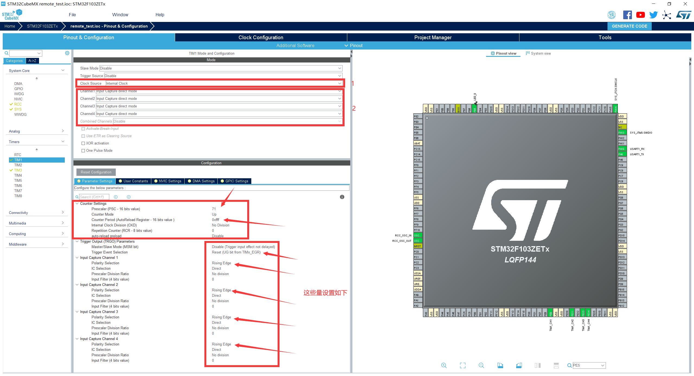
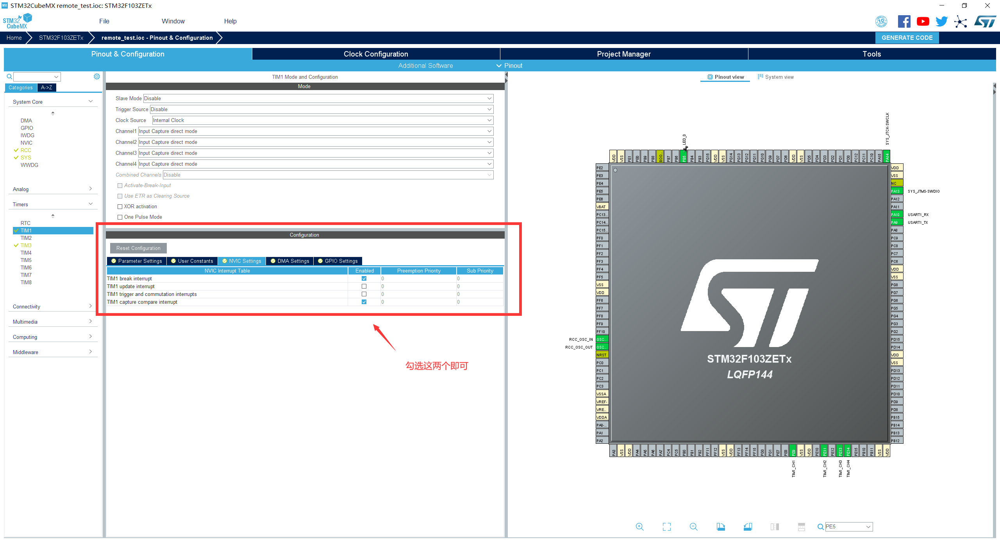
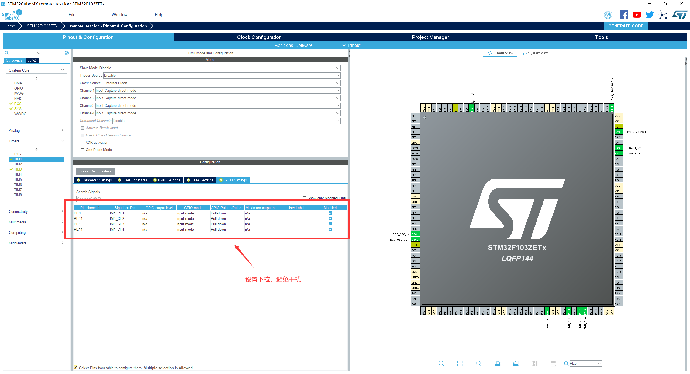
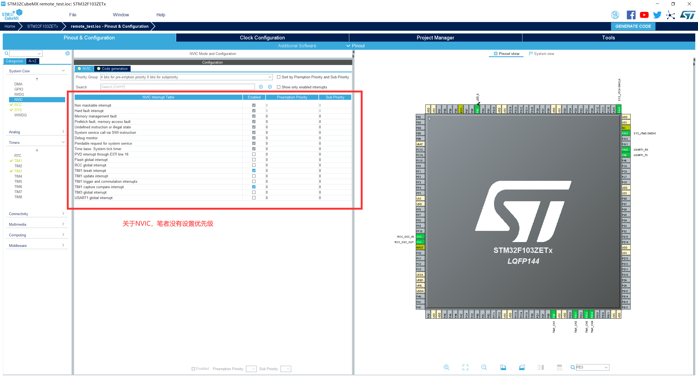
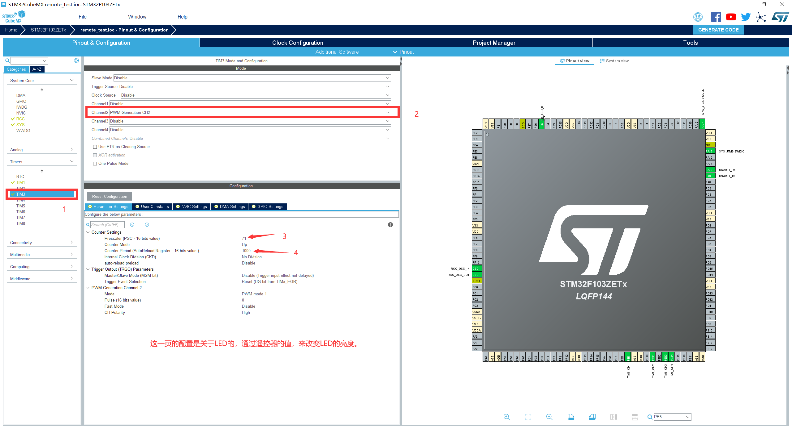
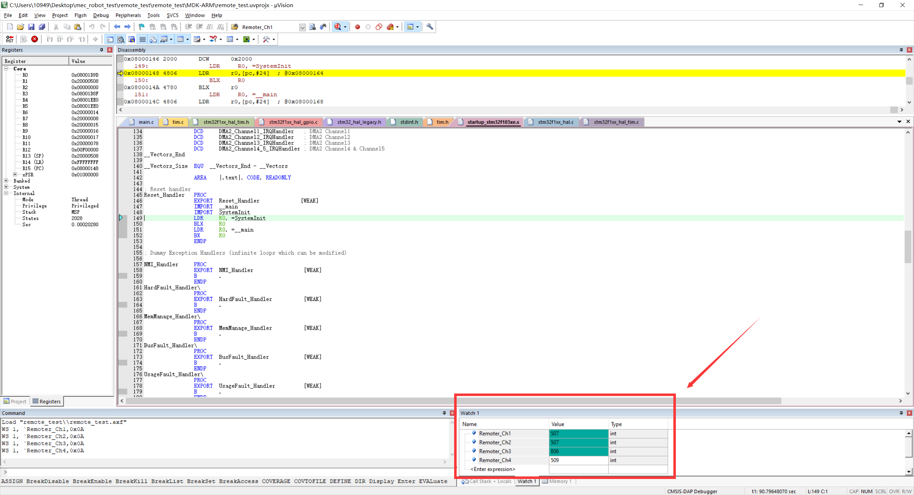
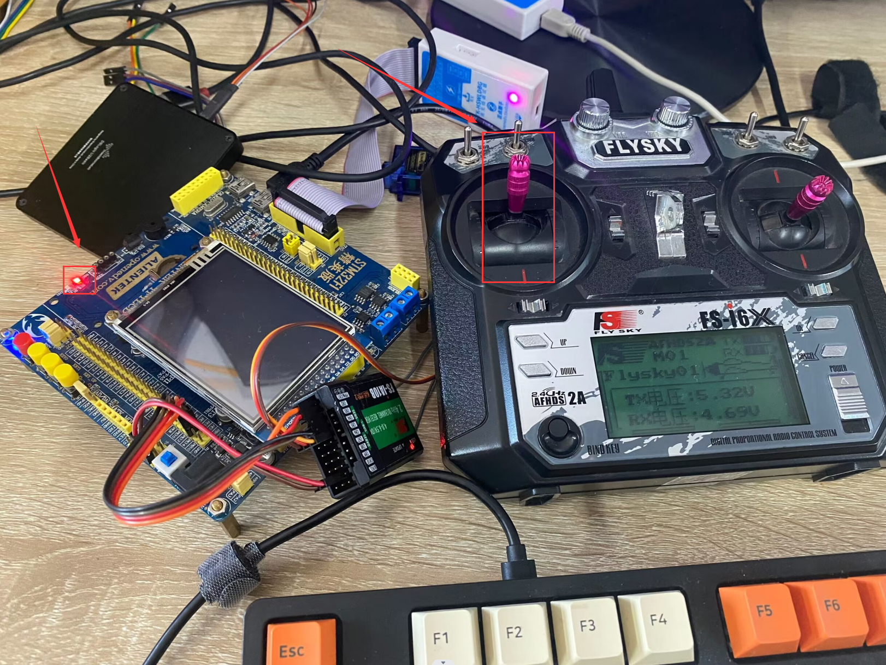

最后更新：2023年2月26日 | 阅读全文需8分钟

## 一、问题引入

> **航模遥控器**是机器人开发中非常常见的控制器，其输出信号稳定，性能强大。航模遥控器需要配合**接收机**进行通讯，接收机支持PPM、PWM、SBUS、IBUS信号输出。笔者之前基于标准库写过一个航模遥控器PPM信号解析的程序，能对航模遥控器10通道数据进行获取，基于PPM信号的特性，在STM32端仅需**定时器的一个通道**即可完成PPM信号的读取。
>
> 最近在开发轮式移动机器人的过程中，只需要用到航模遥控器的CH1、CH2、CH3、CH4这4个通道，同时甲方要求使用**接收机的PWM信号**，根据要求那么就需要消耗**STM32定时器的四个通道**资源。虽然这样浪费了硬件资源，但也没办法。
>
> 在开发过程中使用定时器TIM1的四个通道去解析PWM信号时，出现了一些奇怪的问题，现记录如下：

## 二、实验过程

- 实验器材：
- 单片机：正点原子STM32F1精英版
- 航模遥控器：FS-i6X
- 接收机：FS-iA10B
- 逻辑分析仪：DSLogic U2Basic

### 2.1 CUBEMX中的配置

1.  选择外部高速时钟作为输入：



​	2.设置调试模式： 



​	3.配置时钟：



​	4.关键一步，笔者这样的配置，结果是1us计数一次：



​	5.勾选这两个中断即可：



​	6.GPIO引脚设置为下拉：



​	7.关于NVIC笔者未进行配置，设置为默认状态：



​	8.配置了一路PWM输出，实现航模遥控器与LED的联动：



​	9.注意事项：相关细节地方的配置，读者请根据自身实验硬件来进行更改。


### 2.2 KEIL中配置

1. 程序tim.c中的配置：

```c
/* USER CODE BEGIN 0 */
#include "usart.h"
int Remoter_Ch1=0,Remoter_Ch2=0,Remoter_Ch3=0,Remoter_Ch4=0,Remoter_Adjustment=-110;
uint8_t TIM1CH1_CAPTURE_STA = 0,TIM1CH2_CAPTURE_STA = 0,TIM1CH3_CAPTURE_STA = 0,TIM1CH4_CAPTURE_STA = 0;	
uint16_t TIM1CH1_CAPTURE_VAL,TIM1CH2_CAPTURE_VAL,TIM1CH3_CAPTURE_VAL,TIM1CH4_CAPTURE_VAL;
/* USER CODE END 0 */
```

```c
/* USER CODE BEGIN 1 */
void HAL_TIM_IC_CaptureCallback(TIM_HandleTypeDef *htim)
{
	HAL_UART_Transmit(&huart1, "a", 10, 10);
	
	if(htim == (&htim1))
	{
		if((TIM1CH1_CAPTURE_STA & 0X80) == 0)//还未成功捕获
		{	
			if (TIM_GET_ITSTATUS(&htim1, TIM_IT_CC1) != RESET) //A capture event occurred on channel 1 //通道1发生捕获事件
			{
				if(TIM1CH1_CAPTURE_STA&0X40)				//捕获到一个下降沿 		
				{	  			
					TIM1CH1_CAPTURE_STA|=0X80;				//标记成功捕获到一次高电平脉宽
					TIM1CH1_CAPTURE_VAL=HAL_TIM_ReadCapturedValue(&htim1,TIM_CHANNEL_1);//获取当前的捕获值.
					TIM_RESET_CAPTUREPOLARITY(&htim1,TIM_CHANNEL_1);   //一定要先清除原来的设置！！
					TIM_SET_CAPTUREPOLARITY(&htim1,TIM_CHANNEL_1,TIM_ICPOLARITY_RISING);//配置TIM1通道1上升沿捕获
				}
				else  										//还未开始,第一次捕获上升沿
				{
					TIM1CH1_CAPTURE_STA=0;					//清空
					TIM1CH1_CAPTURE_VAL=0;
					TIM1CH1_CAPTURE_STA|=0X40;				//标记捕获到了上升沿
					
					__HAL_TIM_DISABLE(&htim1);	//关闭定时器
					__HAL_TIM_SET_COUNTER(&htim1,0);
					TIM_RESET_CAPTUREPOLARITY(&htim1,TIM_CHANNEL_1);   //一定要先清除原来的设置！！
					TIM_SET_CAPTUREPOLARITY(&htim1,TIM_CHANNEL_1,TIM_ICPOLARITY_FALLING);//定时器1通道1设置为下降沿捕获
					__HAL_TIM_ENABLE(&htim1);	//使能定时器
				}		
			}		
		}
		
		if((TIM1CH2_CAPTURE_STA & 0X80) == 0)//还未成功捕获
		{	
			if (TIM_GET_ITSTATUS(&htim1, TIM_IT_CC2) != RESET) //A capture event occurred on channel 1 //通道1发生捕获事件
			{
				if(TIM1CH2_CAPTURE_STA&0X40)				//捕获到一个下降沿 		
				{	  			
					TIM1CH2_CAPTURE_STA|=0X80;				//标记成功捕获到一次高电平脉宽
					TIM1CH2_CAPTURE_VAL=HAL_TIM_ReadCapturedValue(&htim1,TIM_CHANNEL_2);//获取当前的捕获值.
					TIM_RESET_CAPTUREPOLARITY(&htim1,TIM_CHANNEL_2);   //一定要先清除原来的设置！！
					TIM_SET_CAPTUREPOLARITY(&htim1,TIM_CHANNEL_2,TIM_ICPOLARITY_RISING);//配置TIM1通道1上升沿捕获
				}
				else  										//还未开始,第一次捕获上升沿
				{
					TIM1CH2_CAPTURE_STA=0;					//清空
					TIM1CH2_CAPTURE_VAL=0;
					TIM1CH2_CAPTURE_STA|=0X40;				//标记捕获到了上升沿
					
					__HAL_TIM_DISABLE(&htim1);	//关闭定时器
					__HAL_TIM_SET_COUNTER(&htim1,0);
					TIM_RESET_CAPTUREPOLARITY(&htim1,TIM_CHANNEL_2);   //一定要先清除原来的设置！！
					TIM_SET_CAPTUREPOLARITY(&htim1,TIM_CHANNEL_2,TIM_ICPOLARITY_FALLING);//定时器1通道1设置为下降沿捕获
					__HAL_TIM_ENABLE(&htim1);	//使能定时器
				}		
			}		
		}
		
		if((TIM1CH3_CAPTURE_STA & 0X80) == 0)//还未成功捕获
		{	
			if (TIM_GET_ITSTATUS(&htim1, TIM_IT_CC3) != RESET) //A capture event occurred on channel 1 //通道1发生捕获事件
			{
				if(TIM1CH3_CAPTURE_STA&0X40)				//捕获到一个下降沿 		
				{	  			
					TIM1CH3_CAPTURE_STA|=0X80;				//标记成功捕获到一次高电平脉宽
					TIM1CH3_CAPTURE_VAL=HAL_TIM_ReadCapturedValue(&htim1,TIM_CHANNEL_3);//获取当前的捕获值.
					TIM_RESET_CAPTUREPOLARITY(&htim1,TIM_CHANNEL_3);   //一定要先清除原来的设置！！
					TIM_SET_CAPTUREPOLARITY(&htim1,TIM_CHANNEL_3,TIM_ICPOLARITY_RISING);//配置TIM1通道1上升沿捕获
				}
				else  										//还未开始,第一次捕获上升沿
				{
					TIM1CH3_CAPTURE_STA=0;					//清空
					TIM1CH3_CAPTURE_VAL=0;
					TIM1CH3_CAPTURE_STA|=0X40;				//标记捕获到了上升沿
					
					__HAL_TIM_DISABLE(&htim1);	//关闭定时器
					__HAL_TIM_SET_COUNTER(&htim1,0);
					TIM_RESET_CAPTUREPOLARITY(&htim1,TIM_CHANNEL_3);   //一定要先清除原来的设置！！
					TIM_SET_CAPTUREPOLARITY(&htim1,TIM_CHANNEL_3,TIM_ICPOLARITY_FALLING);//定时器1通道1设置为下降沿捕获
					__HAL_TIM_ENABLE(&htim1);	//使能定时器
				}		
			}		
		}
		
		if((TIM1CH4_CAPTURE_STA & 0X80) == 0)//还未成功捕获
		{	
			if (TIM_GET_ITSTATUS(&htim1, TIM_IT_CC4) != RESET) //A capture event occurred on channel 1 //通道1发生捕获事件
			{
				if(TIM1CH4_CAPTURE_STA&0X40)				//捕获到一个下降沿 		
				{	  			
					TIM1CH4_CAPTURE_STA|=0X80;				//标记成功捕获到一次高电平脉宽
					TIM1CH4_CAPTURE_VAL=HAL_TIM_ReadCapturedValue(&htim1,TIM_CHANNEL_4);//获取当前的捕获值.
					TIM_RESET_CAPTUREPOLARITY(&htim1,TIM_CHANNEL_4);   //一定要先清除原来的设置！！
					TIM_SET_CAPTUREPOLARITY(&htim1,TIM_CHANNEL_4,TIM_ICPOLARITY_RISING);//配置TIM1通道1上升沿捕获
				}
				else  										//还未开始,第一次捕获上升沿
				{
					TIM1CH4_CAPTURE_STA=0;					//清空
					TIM1CH4_CAPTURE_VAL=0;
					TIM1CH4_CAPTURE_STA|=0X40;				//标记捕获到了上升沿
					
					__HAL_TIM_DISABLE(&htim1);	//关闭定时器
					__HAL_TIM_SET_COUNTER(&htim1,0);
					TIM_RESET_CAPTUREPOLARITY(&htim1,TIM_CHANNEL_4);   //一定要先清除原来的设置！！
					TIM_SET_CAPTUREPOLARITY(&htim1,TIM_CHANNEL_4,TIM_ICPOLARITY_FALLING);//定时器1通道1设置为下降沿捕获
					__HAL_TIM_ENABLE(&htim1);	//使能定时器
				}		
			}		
		}
		
	
	}
	HAL_UART_Transmit(&huart1, "b", 10, 10);
}	
/* USER CODE END 1 */
```

​	2.程序tim.h中的配置：

```c
/* USER CODE BEGIN Private defines */
extern int Remoter_Ch1,Remoter_Ch2,Remoter_Ch3,Remoter_Ch4,Remoter_Adjustment;
extern uint8_t TIM1CH1_CAPTURE_STA,TIM1CH2_CAPTURE_STA,TIM1CH3_CAPTURE_STA,TIM1CH4_CAPTURE_STA;	
extern uint16_t TIM1CH1_CAPTURE_VAL,TIM1CH2_CAPTURE_VAL,TIM1CH3_CAPTURE_VAL,TIM1CH4_CAPTURE_VAL;
/* USER CODE END Private defines */
```

​	3.程序main.c中的配置：

```c
int main(void)
{
  /* USER CODE BEGIN 1 */
	
  /* USER CODE END 1 */
  

  /* MCU Configuration--------------------------------------------------------*/

  /* Reset of all peripherals, Initializes the Flash interface and the Systick. */
  HAL_Init();

  /* USER CODE BEGIN Init */

  /* USER CODE END Init */

  /* Configure the system clock */
  SystemClock_Config();

  /* USER CODE BEGIN SysInit */

  /* USER CODE END SysInit */

  /* Initialize all configured peripherals */
  MX_GPIO_Init();
  MX_USART1_UART_Init();
  MX_TIM1_Init();
  MX_TIM3_Init();
  /* USER CODE BEGIN 2 */
	HAL_TIM_IC_Start_IT(&htim1,TIM_CHANNEL_1);	//一定要开启TIM1通道1的捕获中断
	HAL_TIM_IC_Start_IT(&htim1,TIM_CHANNEL_2);	//一定要开启TIM1通道2的捕获中断
	HAL_TIM_IC_Start_IT(&htim1,TIM_CHANNEL_3);	//一定要开启TIM1通道3的捕获中断
	HAL_TIM_IC_Start_IT(&htim1,TIM_CHANNEL_4);	//一定要开启TIM1通道4的捕获中断
	
    HAL_TIM_Base_Start(&htim3);				    //开启定时器	    
    HAL_TIM_PWM_Start(&htim3, TIM_CHANNEL_2);	 //开启PWM通道
	
  /* USER CODE END 2 */

  /* Infinite loop */
  /* USER CODE BEGIN WHILE */
  while (1)
  {
    /* USER CODE END WHILE */

    /* USER CODE BEGIN 3 */
		if(TIM1CH1_CAPTURE_STA & 0X80)									//完成一次高电平捕获
		{		
			Remoter_Ch1 = TIM1CH1_CAPTURE_VAL+Remoter_Adjustment;						//总的高电平时间
			TIM1CH1_CAPTURE_STA = 0;											//准备下一次捕获
		}
		
		if(TIM1CH2_CAPTURE_STA & 0X80)									//完成一次高电平捕获
		{		
			Remoter_Ch2 = TIM1CH2_CAPTURE_VAL+Remoter_Adjustment;						//总的高电平时间
			TIM1CH2_CAPTURE_STA = 0;											//准备下一次捕获
		}
		
		if(TIM1CH3_CAPTURE_STA & 0X80)									//完成一次高电平捕获
		{		
			Remoter_Ch3 = TIM1CH3_CAPTURE_VAL+Remoter_Adjustment;						//总的高电平时间
			TIM1CH3_CAPTURE_STA = 0;											//准备下一次捕获
		}
		
		if(TIM1CH4_CAPTURE_STA & 0X80)									//完成一次高电平捕获
		{		
			Remoter_Ch4 = TIM1CH4_CAPTURE_VAL+Remoter_Adjustment;						//总的高电平时间
			TIM1CH4_CAPTURE_STA = 0;											//准备下一次捕获
		}
		
		__HAL_TIM_SetCompare(&htim3, TIM_CHANNEL_2, 1100-Remoter_Ch3);
    	HAL_Delay(10);
  }
  /* USER CODE END 3 */
}
```

2.3 实验效果展示

​	1.在调试模式中能准确读取到PWM报文中，高电平脉冲的时长：



​	2.实物实验，通过遥感可以控制LED灯的亮度：



## 三、全文小结

> 细心的读者可能会看见，我在中断函数中加入了这两行代码，关于本文所讲述的实验，调试的时候其实出现了一些BUG，就比如不增加下述两行代码，定时器读到的值就是错误的，关于这个问题的来源暂未得到解决。但本人做了一些分析：我用逻辑分析仪测量四路PWM信号时，发现他们是“同时”触发的，相当于定时器的四个通道是“同时”触发中断？只能说这套程序能用，后面开发可能会继续使用PPM协议，抛弃PWM协议。关于网上的资源，通常都是讲的针对一个通道的接收，基本未提及到四路通道的接收，上述程序针对一个通道接收时，非常稳定，针对四路通道，加上以下两行代码就正常了，这两行代码对应在tim.c的中断回调函数中。😉

```c
HAL_UART_Transmit(&huart1, "a", 10, 10);
......
HAL_UART_Transmit(&huart1, "b", 10, 10);
```

联系笔者：ehangmaker@163.com
