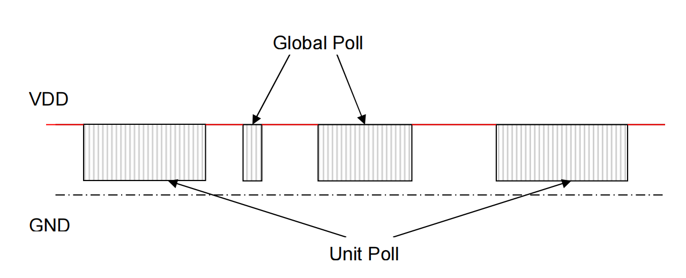

## 一、V-PLEX协议简介

> V-Plex总线是霍尼韦尔报警主机的总线协议，类似485总线,具有1200米传输距离，增加总线延伸模块还能再延伸，但是只能延伸一次。

## 二、V-PLEX通信概述

- 首先，主板将进行全局轮询。如果外围设备要报告警报，**它将前导码的最后一位从“1”变到“0”**。主板将继续发布剩下的全局轮询。外围设备将向该全局轮询发出其地址。主板将通过发送单元轮询来处理该外围设备，以接收来自该外围设备的报警信息。

- 为安全起见，主板将发送⒉次单元轮询。这个外围设备将向该单元轮询发送报警信息。最后，主板将发出第三个单元轮询，以重置该外围设备的报警状态。



### 2.1 Global Poll

- 全局轮询用于查找要报告报警信息的外围设备。首先，主板将发布前导码“111”。如果外围设备希望向主板报告警报。它将最后一位从“1”绘制到“0”。然后，主板将检测到此“0”，并继续发布全局轮询的其余位。否则，主板将停止并在10ms断开后重新启动。

**Global Poll时序图如下：**


**Global Poll关键点如下：**

1. 接受来自V-Plex扩展器模块（如4208U)的报警报告。首先生成“111”。如果任何模块将报告报警，则需要将最后一个位从“1”绘制到“o”。因此，总线上显示的实际数据为“110”。关于如何将“1”绘制到“0”，请参考章节，位数据“1”和“0”。由于总线上的每个模块都能够通过全局轮询报告警报，因此非常高效。全球轮询的最后7位用于报告警报。
2. 大大减少每个设备的报警报告时间。当主板通过全局轮询接收到报警报告时，主板将发出一系列单元轮询，通过发出几个单元轮询来检查此设备。典型的全局轮询大约需要3毫秒(3位*1毫秒/位）。当通过全局轮询进行报警报告时，需要32ms。


### 2.2 Unit Poll

- 单元轮询用于通过主板从特定外围设备接收详细的报警信息。当外围设备接收到与自身匹配的20位序列号地址的单元轮询时。它将响应此单元轮询，并从此单元轮询接收控制信息，将报警信息发送到此单元轮询。

**Unit Poll时序图如下：**


**Unit Poll关键点如下：**

1. 单位轮询的长度为34位（所有时间)。所以它需要34毫秒。


### 2.3 字段描述

- 全局轮询和单位轮询都有一些通用字段，如地址、状态。


## 三、奇偶校验规则

- [定义](https://zhuanlan.zhihu.com/p/26509678)：用来检测数据传输过程中是否发生错误，是众多校验码中最为简单的一种。
- 奇校验：原始码流+校验位 总共有奇数个1
- 偶校验：原始码流+校验位 总共有偶数个1


```c
/**
 *
 * @param  mode
 * @param  array
 * @param  len
 * @return ret
 */
uint8_t vplex_parity_check(uint8_t mode, uint8_t *array, uint8_t len)
{
    uint16_t sum = 0, ret = 0;

    for (uint16_t i = 0; i <= len; i++)
    {
        sum += array[i];
    }

    if (mode == EVEN_CHECK)
    {   // 前偶数情况后奇数情况
        (sum % 2 == 0) ? (ret = 0) : (ret = 1);
        // 偶校验 （even parity）：如果字符数据位中"1"的数目是偶数，则校验位应为"0"，如果是奇数则为"1"。（校验位调整个数）
    }
    else
    {
        (sum % 2 == 0) ? (ret = 1) : (ret = 0);
        // 奇校验 （odd parity）：如果字符数据位中"1"的数目是偶数，校验位为"1"，如果"1"的数目是奇数，校验位应为"0"。（校验位调整个数）
    }

    return ret;
}
```


联系笔者：ehangmaker@163.com
