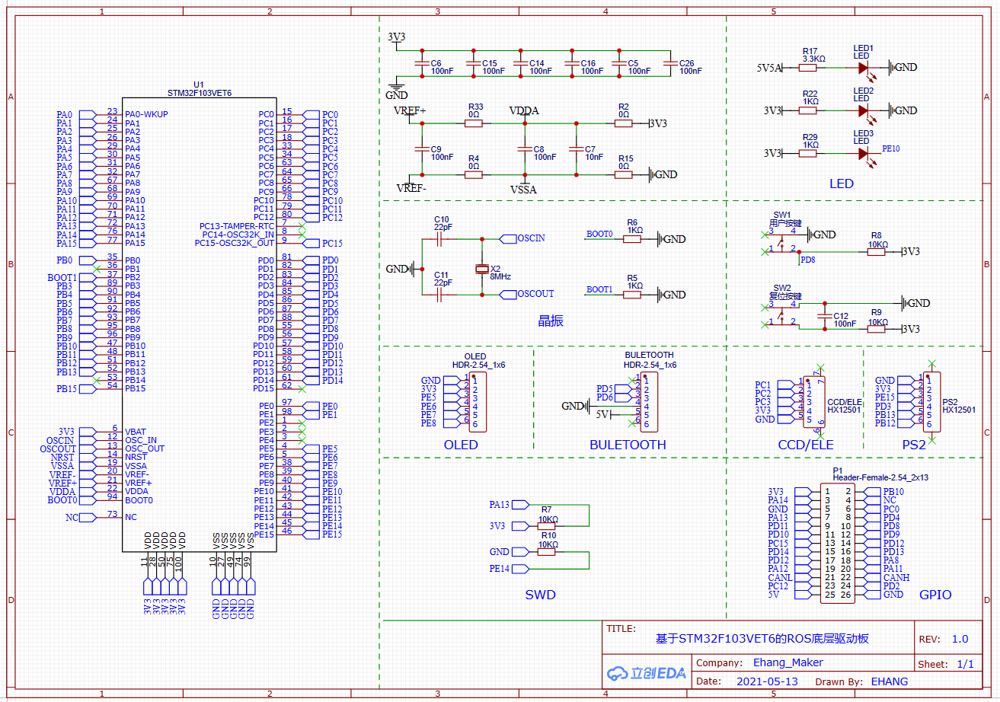
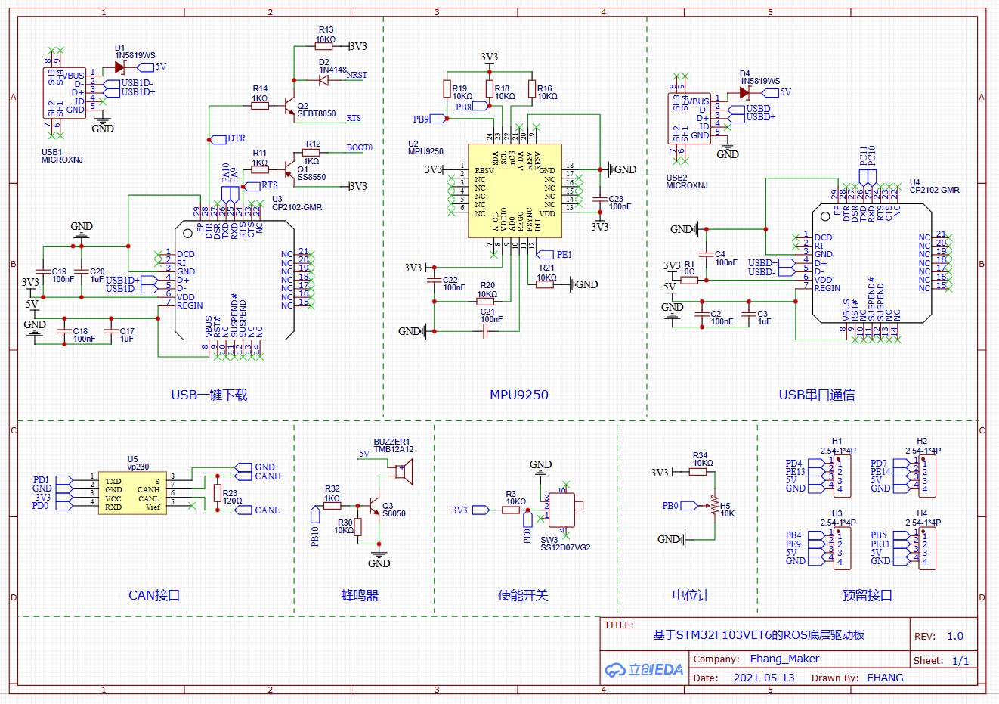
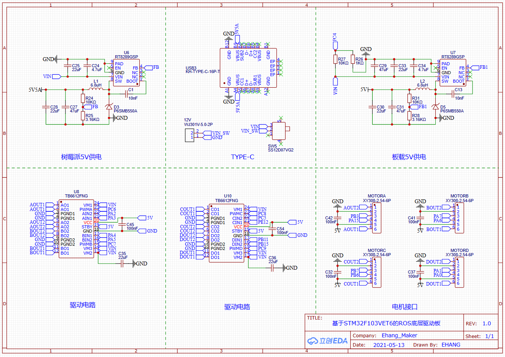
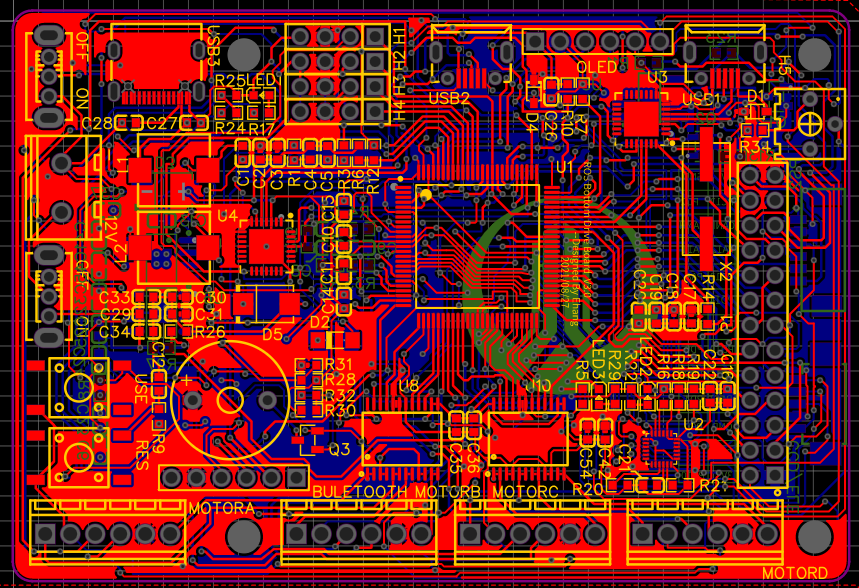
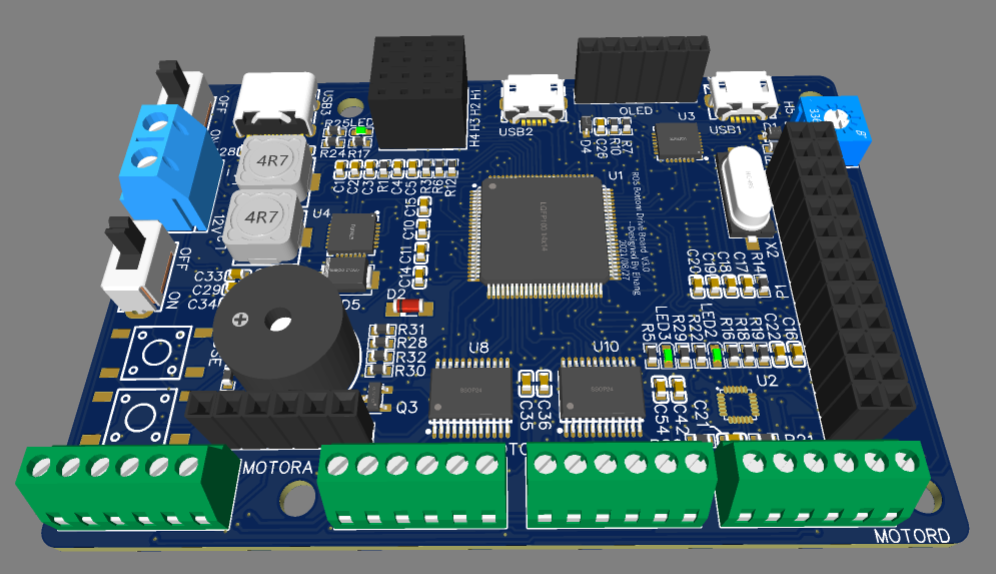
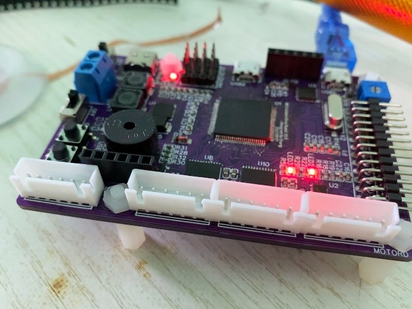

## 一、驱动板功能

该驱动板为麦克纳姆轮移动机器人的控制核心。能控制四个直流减速电机完成闭环、速度环控制；陀螺仪位姿解算；串口、IIC、CAN协议通信；航模遥控器控制；蓝牙控制；OLED显示等功能。

## 二、板载资源

1. 主控：STM32F103VET6
2. 陀螺仪：MPU9250
3. CAN：VP230
4. 串口：CP2102
5. 电机驱动：TB6612FNG

## 三、原理图

## 四、PCB图

## 五、立创EDA三维模型

## 六、实际焊接效果

联系笔者：ehangmaker@163.com