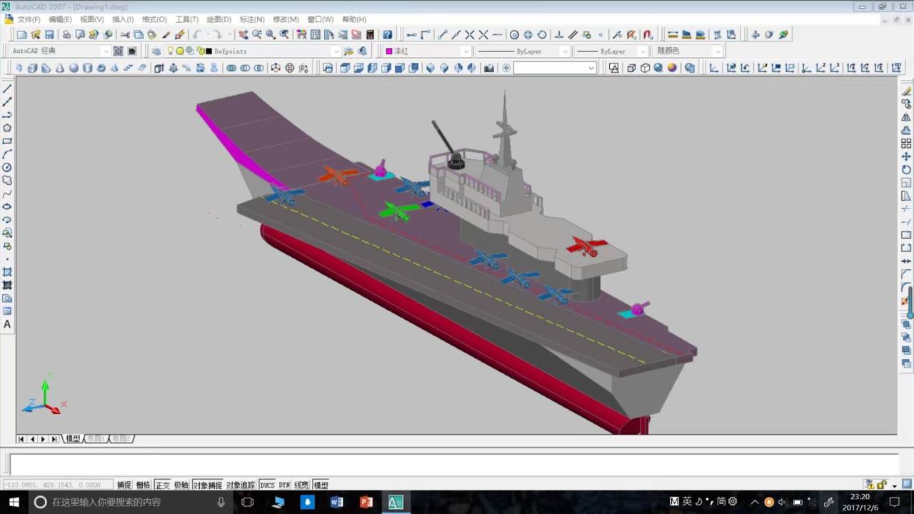
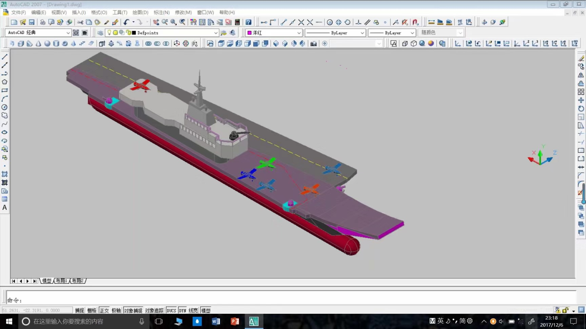
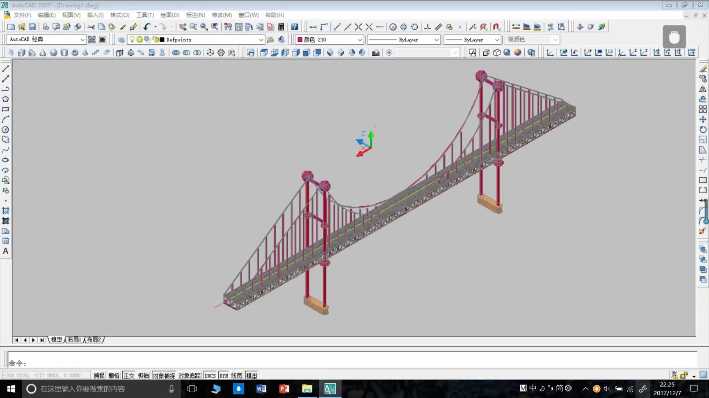

🙅‍♂️【知识产权声明】🚫机械设计作品展中的内容绝大多数已申请了知识产权保护，涉及较为核心的结构不作展示。

作为【机械电子工程专业】的学生，机械设计技术自然也不能落后呀！😎

感觉从小我的空间立体感较强，脑海中能快速浮现结构的三维形状，记得初中数学中的立体几何是我的强项~

## 一、创新基因的培养

大一入学开始，发现还有CAD这种辅助绘图的工具，简直是我创作的好帮手，欣赏一波我**大一**刚接触CAD绘制的作品吧：

（都是17年设计的，年代有些久远，当时是设计了“航空母舰”、“金门大桥”、“东方明珠”、“埃菲尔铁塔”、“广州塔”等模型，翻遍了旧手机相册，这能找到下面这些了）

**1.航空母舰**

**2.金门大桥**

## 二、创新思维的延续

1. 大一期间最早接触了CAD绘图软件，但是感觉CAD已经不能满足我三维绘制的需求，当时请教了我的CAD老师，在她的推荐下我开始自学一系列三维设计软件，Solidworks、CATIA、UG、3DMAX本人都有涉猎。
2. 学**习这类软件都是兴趣驱动**，得益于大一期间的积累，培养了我三维设计的能力，在后续比赛、项目中给了我很大帮助。
3. 接下来，将针对某一种详细的结构展开介绍本人的机械设计作品。
