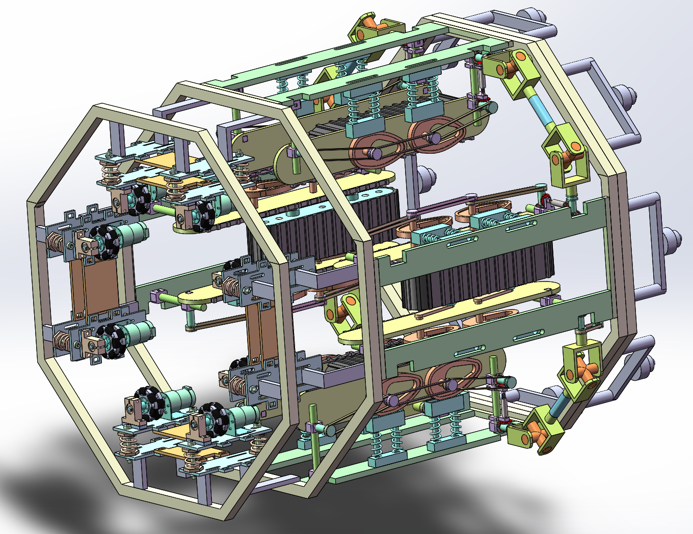
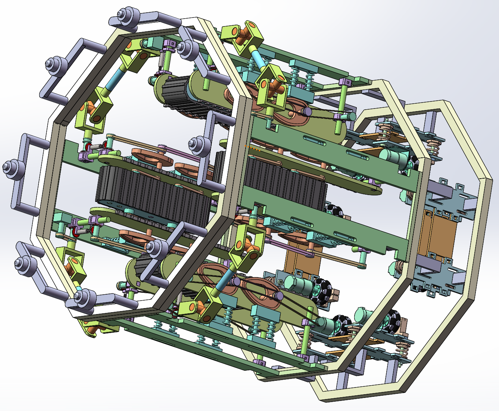
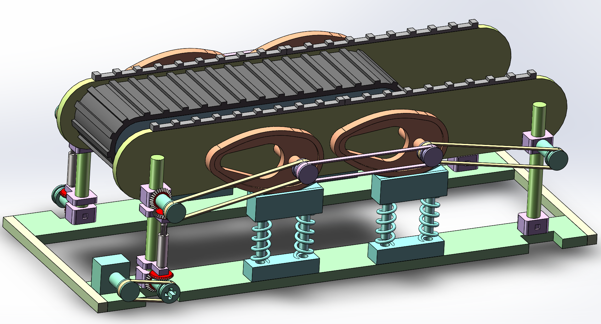
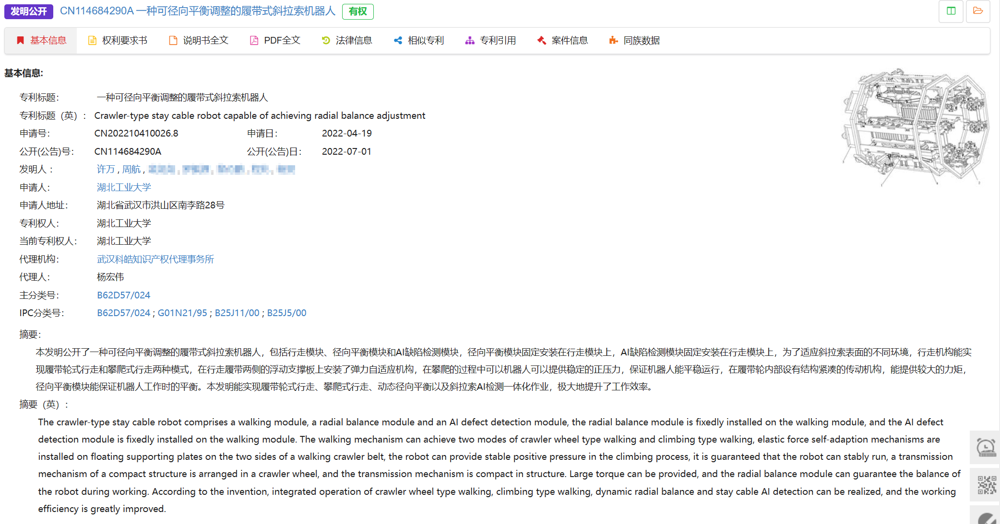

## 一、作品简介

1. **作品名称：**一种可径向平衡调整的履带式斜拉索机器人
2. **作品创新点：**本发明公开了一种可径向平衡调整的履带式斜拉索机器人，包括斜拉索行走模块、径向平衡模块和AI缺陷检测模块，径向平衡模块固定安装在斜拉索行走模块上，AI缺陷检测模块固定安装在斜拉索行走模块上，为了适应斜拉索表面的不同环境，行走机构能实现履带轮式行走和攀爬式行走两种模式，在履带轮的两侧安装了弹力自适应机构，在攀爬的过程中可以机器人可以提供稳定的正压力，保证机器人能平稳运行，在履带轮内部设有结构紧凑的传动机构，能提供较大的力矩，径向平衡模块中安装有八个全向轮，能保证机器人工作时的平衡。本发明能实现履带轮式行走、攀爬式行走、动态径向平衡以及斜拉索AI检测一体化作业，极大地提升了工作效率。在行走时，履带轮外侧板处设有巧妙的凸轮机构弹力自适应装置，能保证机器人安全平稳的工作。

## 二、结构展示

## 三、申请发明专利保护

1. 专利号：ZL202210410026.8

