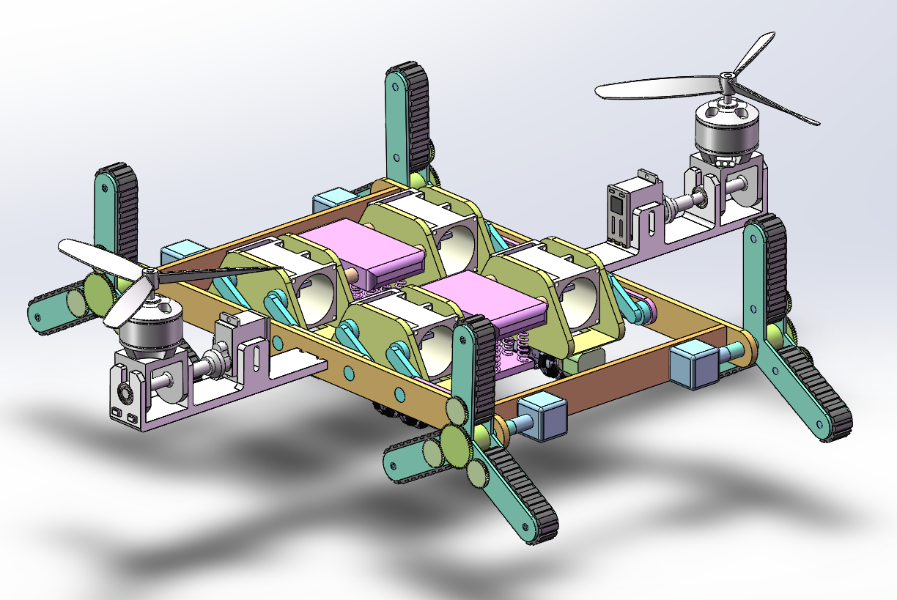
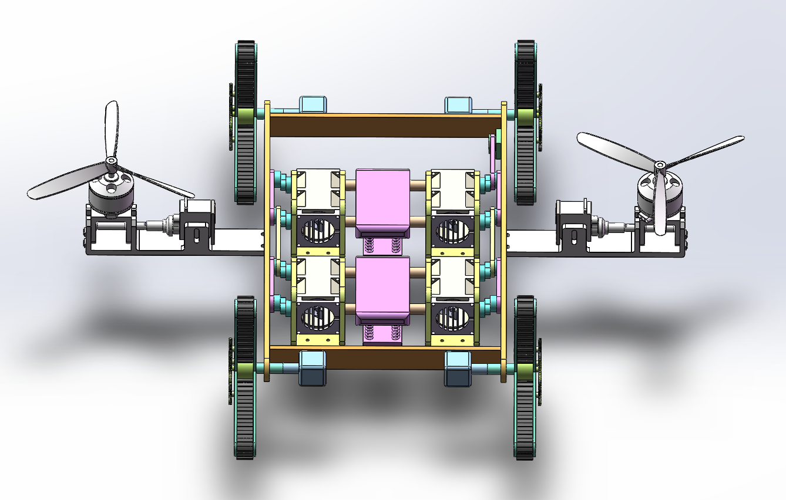
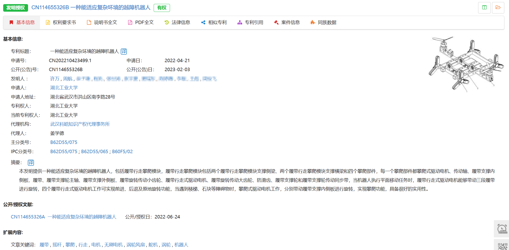

## 一、作品简介

1. **作品名称：**一种能适应复杂环境的越障机器人
2. **作品创新点：**本发明公开了一种能适应复杂环境的越障机器人，包括履带行走攀爬模块、交替式行走及横向移动模块和双旋翼横列式飞行模块，交替式行走及横向移动模块转动安装在履带行走攀爬模块上，双旋翼横列式飞行模块固定安装在履带行走攀爬模块上，为了实现机器人底盘能在不同复杂地面行驶，履带主动轮提供了两种行走方式，同时将交替式行走、全向轮横移、螺旋桨等机构进行了巧妙的融合，在全向轮模块的上方加装了涡轮增压装置，可以实现其单独工作时的转弯动作，在机器人底盘下方设置有陀螺仪避震装置，为陀螺仪的稳定工作提供了保障。本发明集成履带式行走、复杂障碍物攀爬跨越、交替式行走、横向行走、涡轮增压转向、飞行等功能于一体，极大提升了机器人底盘的作业范围。

## 二、结构展示

## 三、申请发明专利保护

1. 专利号：ZL202210423499.1

