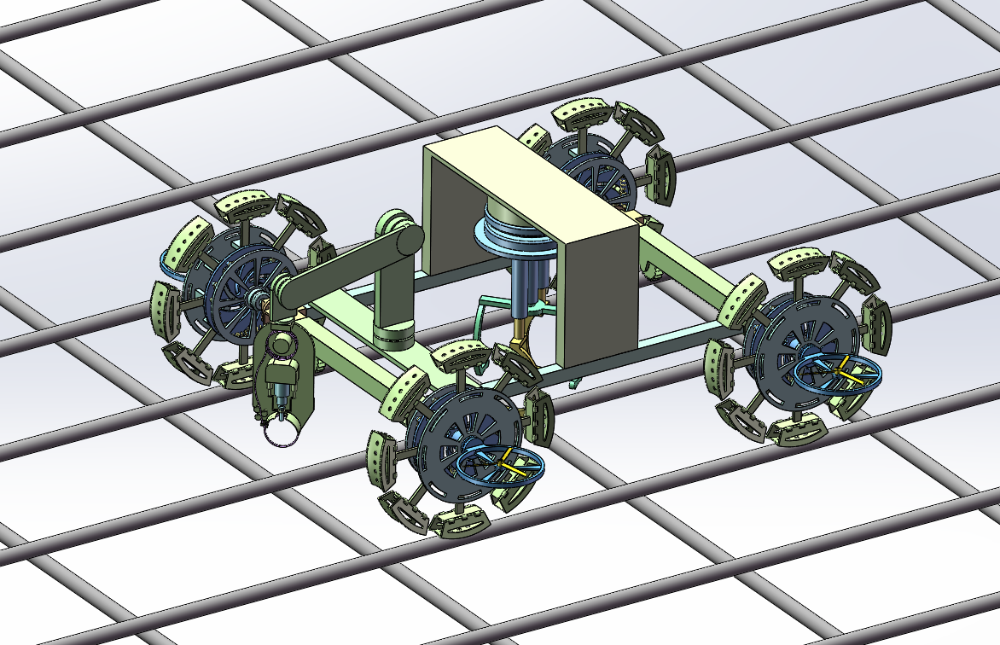
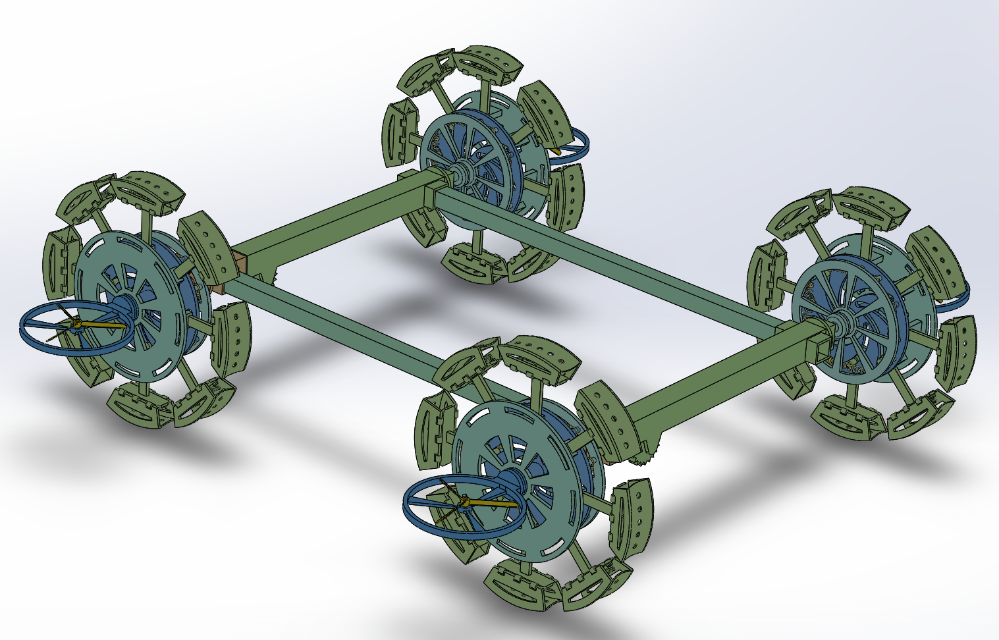
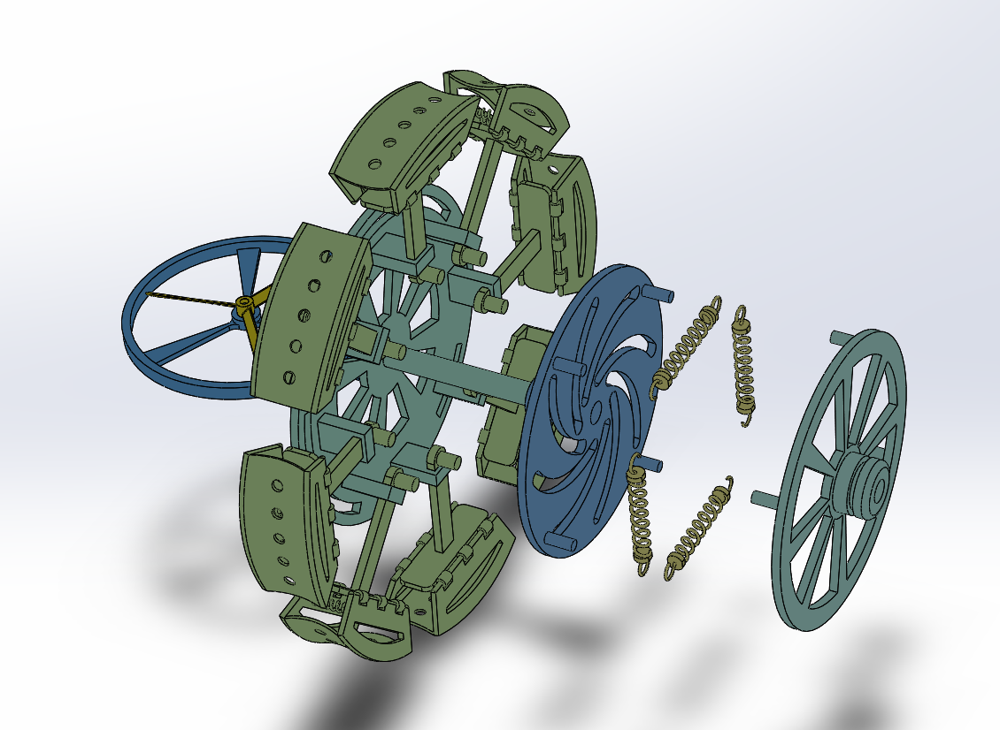
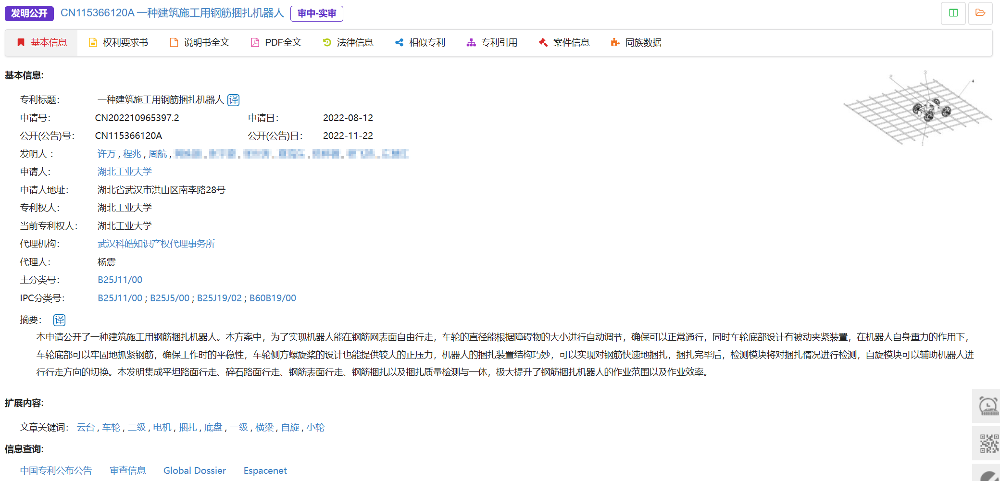

## 一、作品简介

1. **作品名称：**一种建筑施工用钢筋捆扎机器人
2. **作品创新点：**本发明公开了一种建筑施工用钢筋捆扎机器人，包括钢筋网表面行走模块、钢筋捆扎模块和机器人自旋及捆扎检测模块，钢筋捆扎模块支撑底板固定安装在底盘侧方横梁上，机器人自旋及捆扎检测模块支撑架固定安装在底盘侧方横梁上，为了实现机器人能在钢筋网表面自由行走，车轮的直径能根据障碍物的大小进行自动调节，确保可以正常通行，同时车轮底部设计有被动夹紧装置，在机器人自身重力的作用下，车轮底部可以牢固地抓紧钢筋，确保工作时的平稳性，车轮侧方螺旋桨的设计也能提供较大的正压力，机器人的捆扎装置结构巧妙，可以实现对钢筋快速地捆扎，捆扎完毕后，检测模块将对捆扎情况进行检测，自旋模块可以辅助机器人进行行走方向的切换。本发明集成平坦路面行走、碎石路面行走、钢筋表面行走、钢筋捆扎以及捆扎质量检测与一体，极大提升了钢筋捆扎机器人的作业范围以及作业效率。

## 二、结构展示

## 三、申请发明专利保护

1. 申请号：CN202210965397.2

