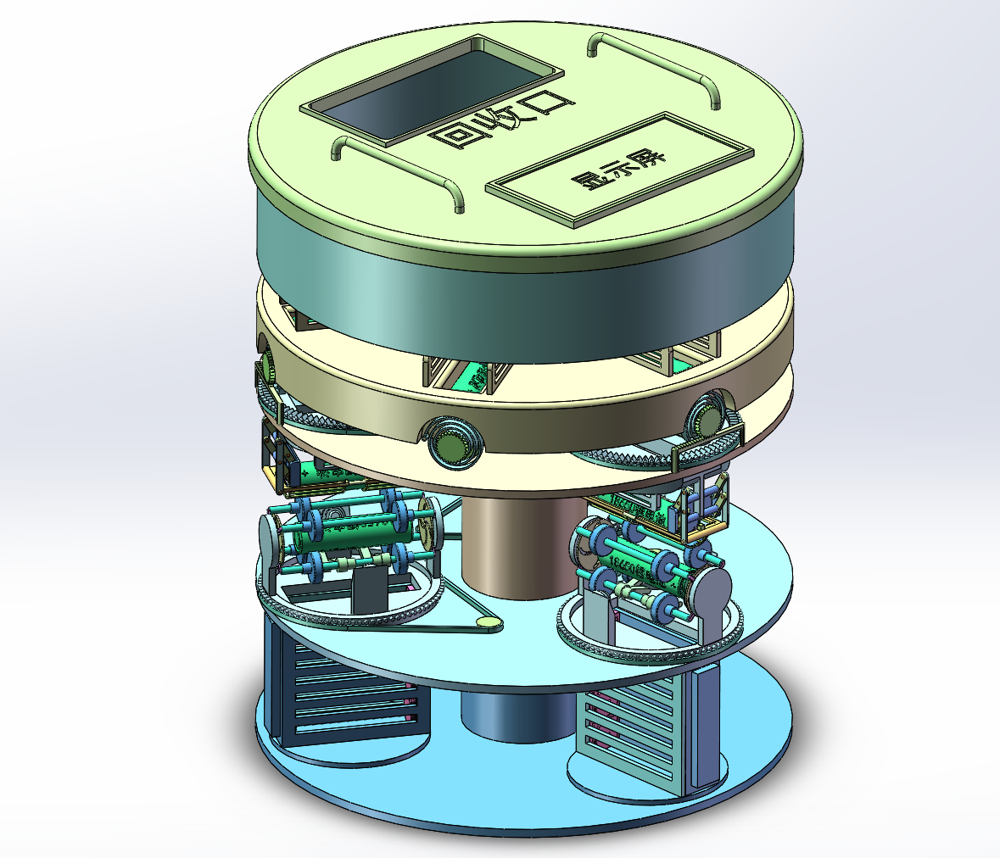
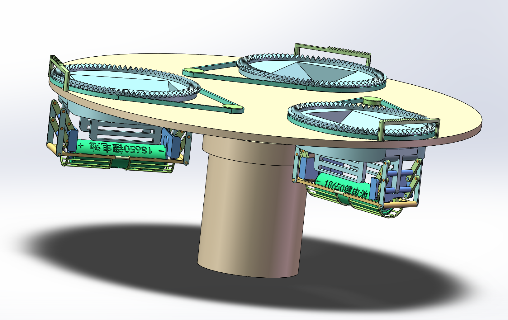
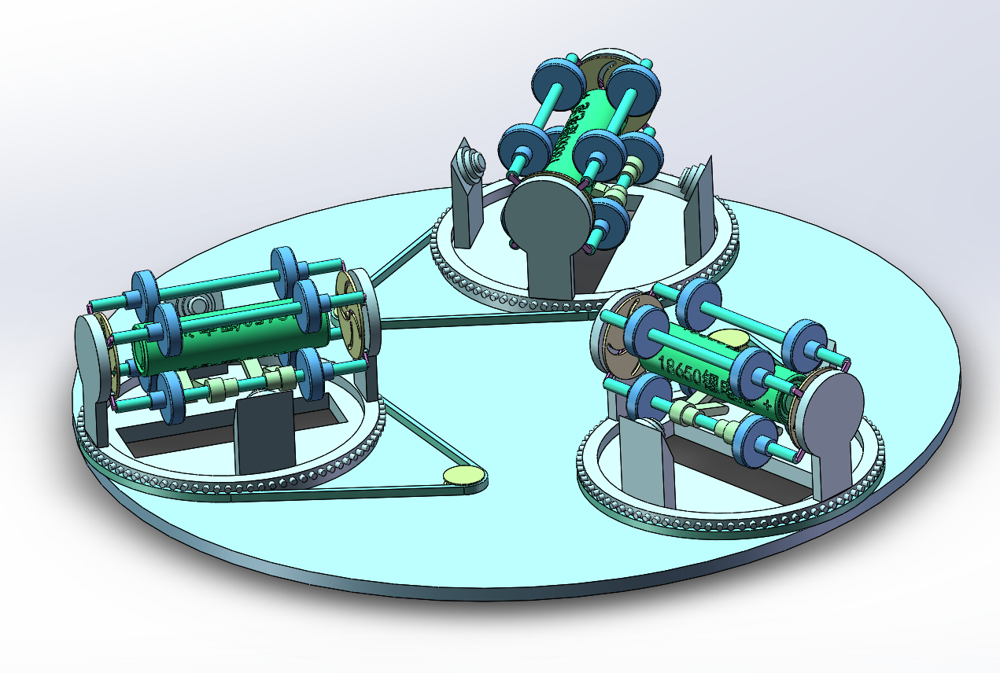
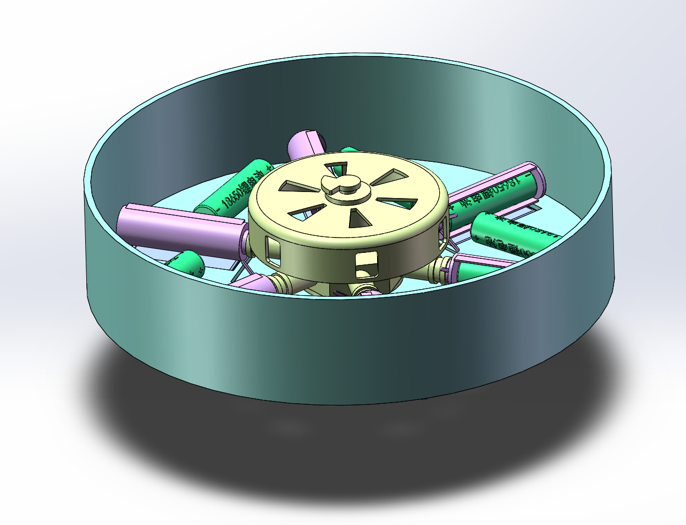
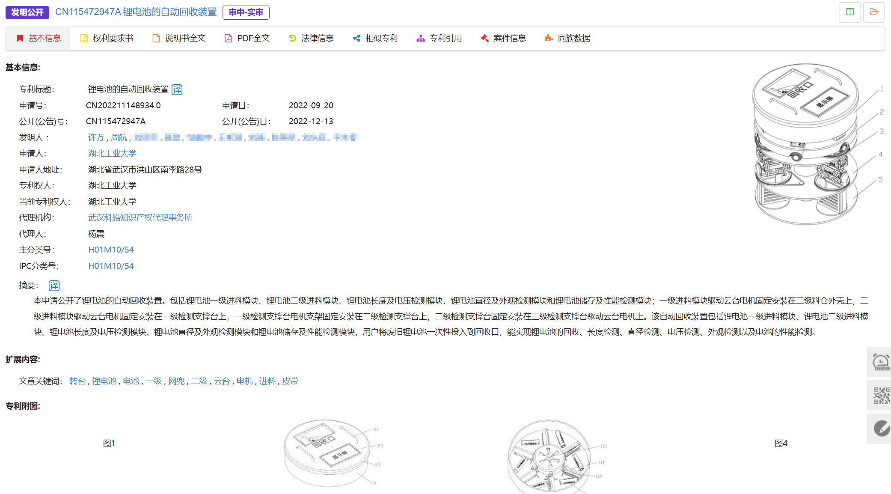

## 一、作品简介

1. **作品名称：**锂电池的自动回收装置
2. **作品创新点：**本发明公开了一种18650锂电池自动回收售卖控制方法及机器，包括锂电池一级进料模块、锂电池二级进料模块、锂电池长度及电压检测模块、锂电池直径及外观检测模块和锂电池储存及性能检测模块，用户将废旧的18650锂电池一次性投入到回收口，同时扫描显示屏中的二维码操作机器工作，机器会对锂电池的性能进行系列检测及评估，从而判断锂电池的价值，判断完毕后会对回收用户进行现金奖励，如果其他用户需要购买二手锂电池，同样扫描显示屏中的二维码，用户根据显示屏指示在电池储存箱中挑选电池并结算。本发明提出了一种18650锂电池回收及售卖方法，能实现锂电池的回收、长度检测、直径检测、电压检测、外观检测以及电池的性能检测，同时能根据二手电池的性能进行定价销售。

## 二、结构展示

## 三、申请发明专利保护

1. 申请号：CN202211148934.0

