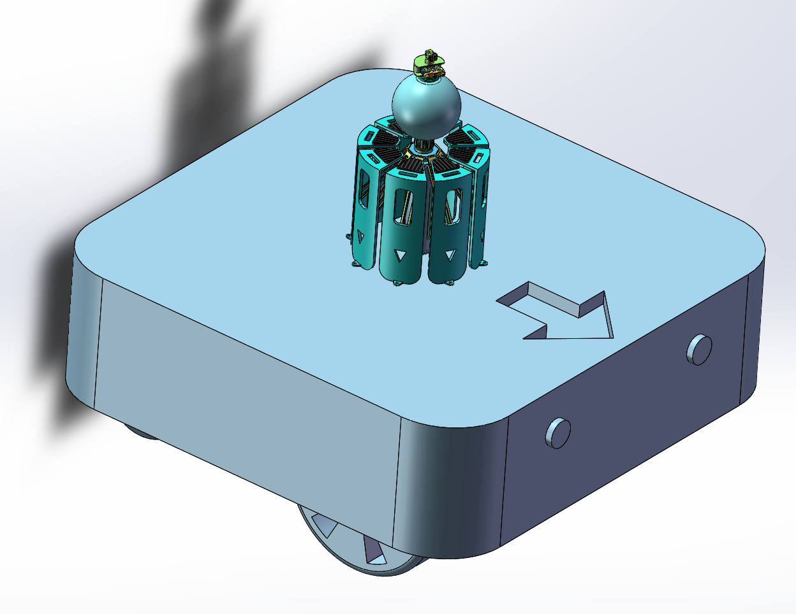
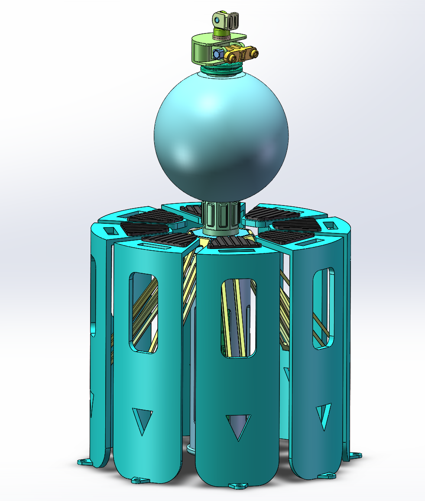
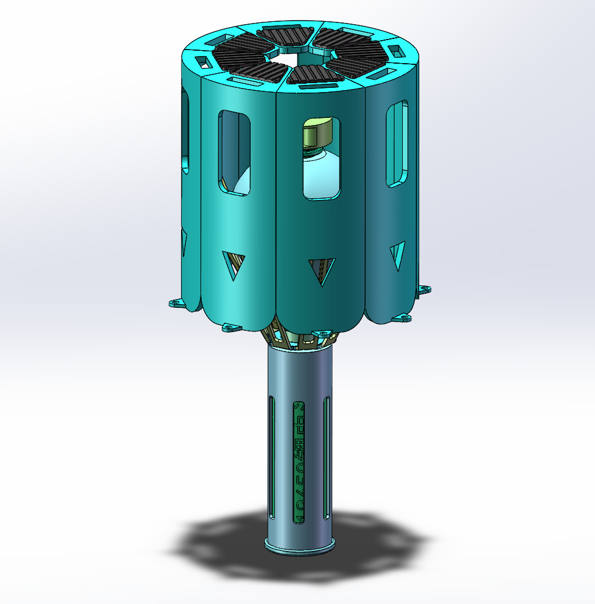
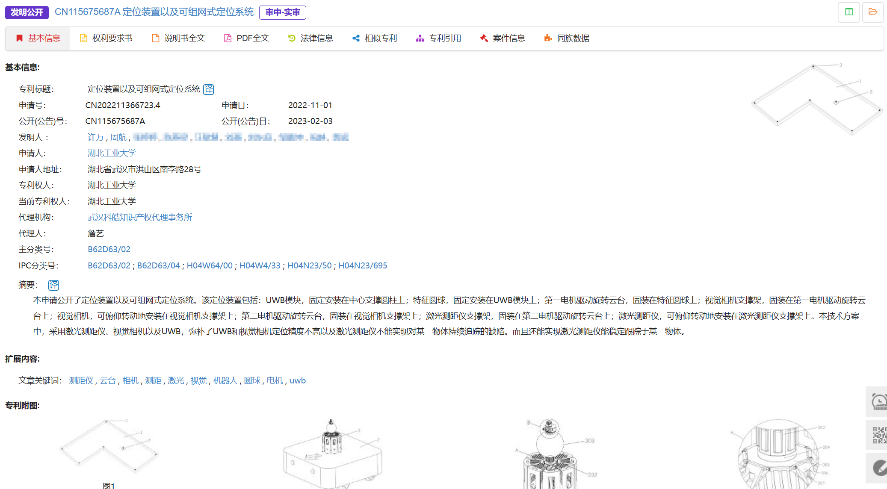

## 一、作品简介

1. **作品名称：**一种可组网式高精度定位系统及装置
2. **作品创新点：**本发明提供了一种可组网式高精度定位装置及系统，该系统由若干个高精度定位装置、移动机器人和环境地图组成。使用过程中，将3个或者3个以上的高精度定位装置摆放在环境地图的角落，摆放的过程中尽量确保没有死角限制，使得相邻的高精度定位装置之间能够透视。整套装置开始启动接力定位，首先在UWB模块的作用下确定各定位装置之间的初步位置，其次启动视觉相机实现对特征圆球的追踪，然后启动激光测距仪实现对移动机器人上方特征圆球中心点的测距。在移动机器人行走的过程中，视觉相机会实时检测特征圆球的移动方向及距离，并将该信息反馈至激光测距仪，从而激光测距仪实现对特征圆球的实时追踪。本发明弥补了UWB和视觉相机定位精度不高，以及激光测距仪不能实现对某一物体持续追踪的缺陷，整套系统的定位精度在±2mm，满足大部分移动机器人的稳定运行条件。

## 二、结构展示

## 三、申请发明专利保护

1. 申请号：CN202211366723.4

