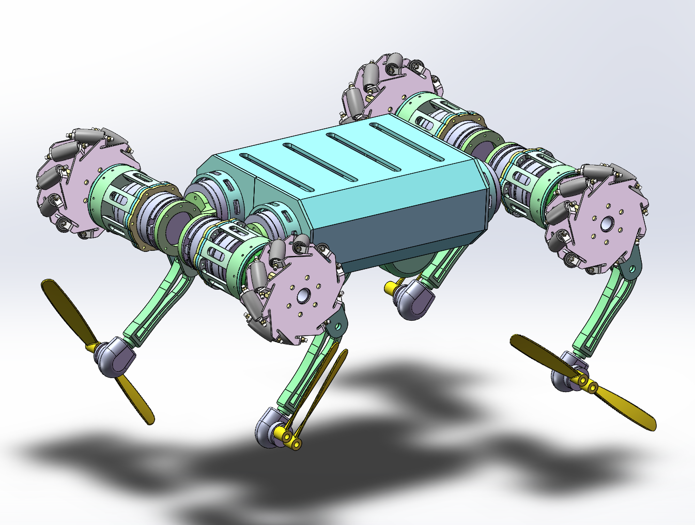
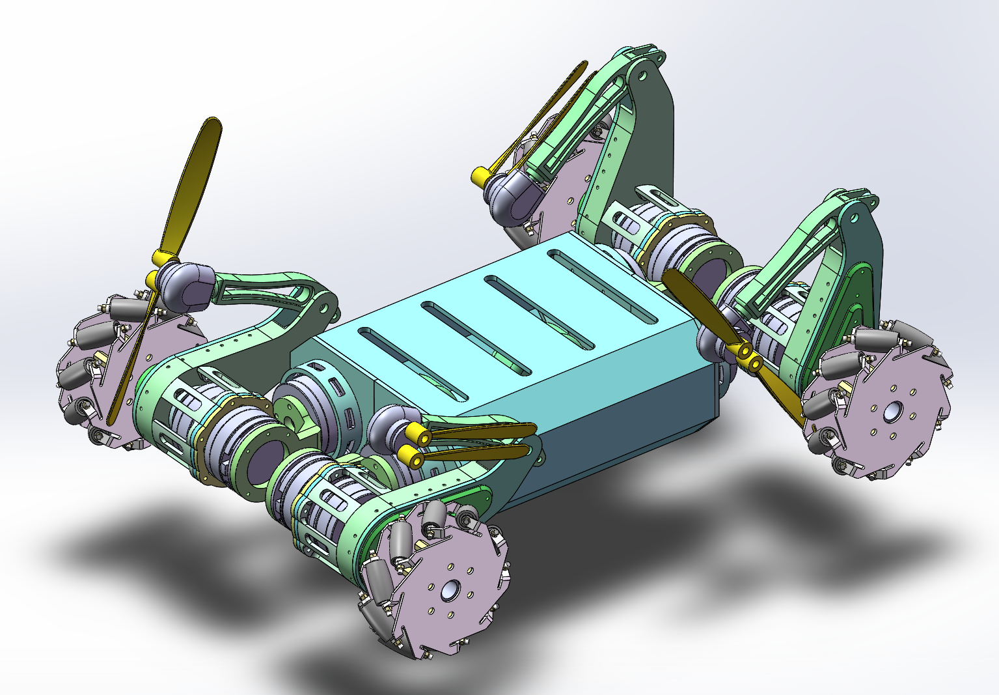
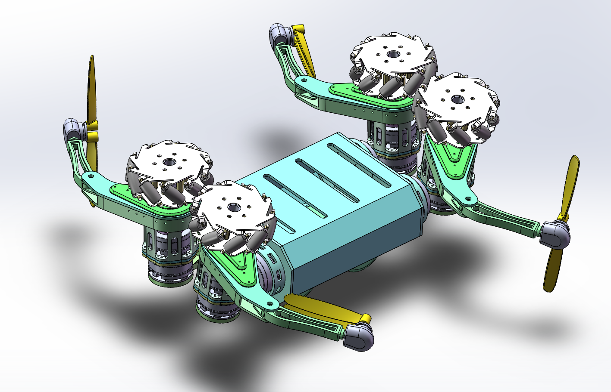
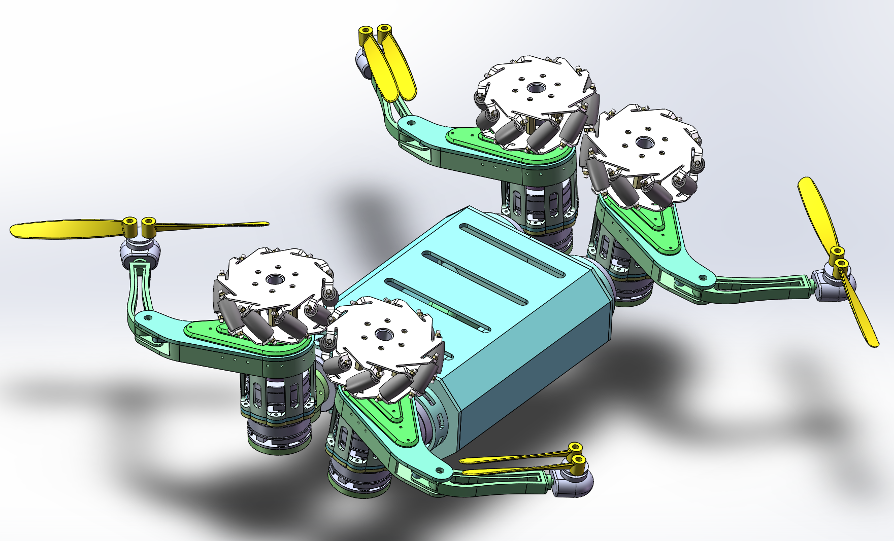

## 一、作品简介

1. **作品名称：**一种海陆空三栖四足机器人
2. **作品创新点：**本发明公开了一种海陆空三栖四足机器人，包括四足机器人多功能腿部模块和四足机器人机身模块，单腿偏转角度驱动无刷电机底座固定安装在无刷电机固定座上，其拥有传统四足机器人的行走功能，同时基于机身巧妙的变换结构，可以实现在地面轮式行走、四旋翼空中飞行以及水面滑翔等功能，螺旋桨配备有自动折叠功能，只有在飞行模式下才会展开，机身传动关节处结构紧凑，并采用无刷电机作为动力源，机身上表面预留有较大空间，可以搭载其他辅助作业设备。本发明结构紧凑，将地面行驶、空中飞行、水面滑翔等功能集于一身，且功能之间不会相互制约，极大地提升了四足机器人的工作效率以及作业范围。

## 二、结构展示

